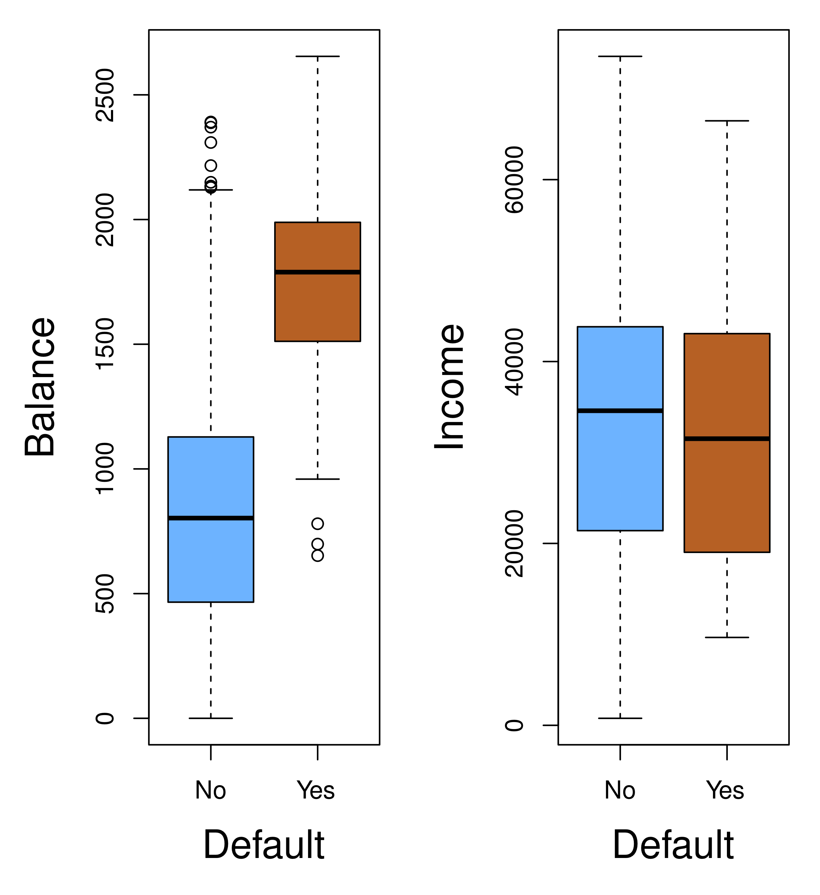
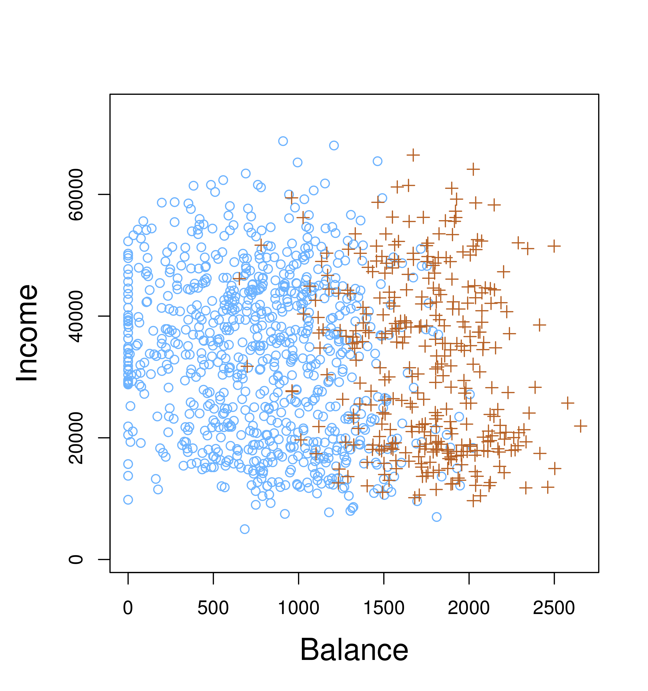
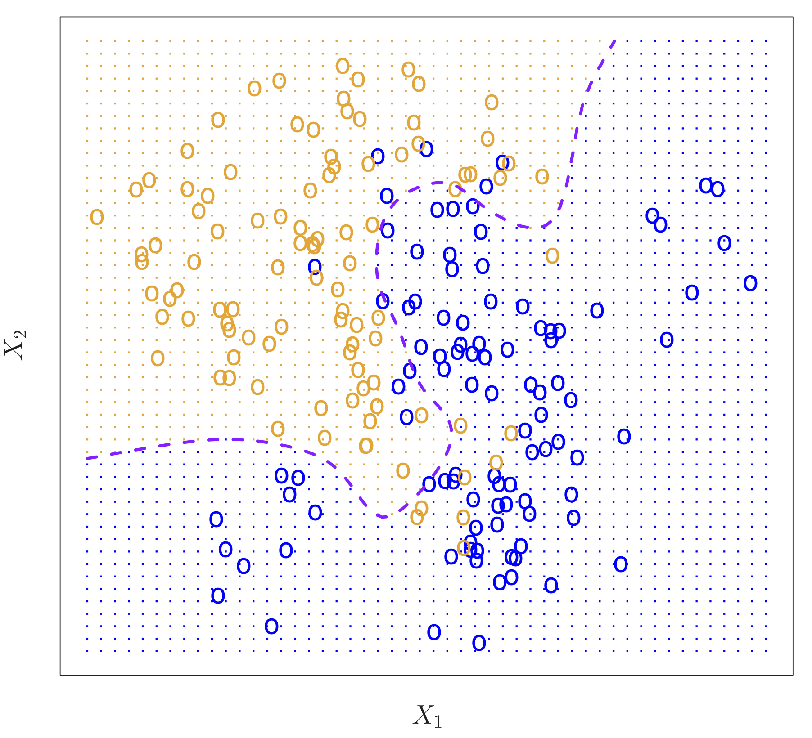
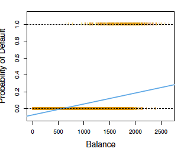
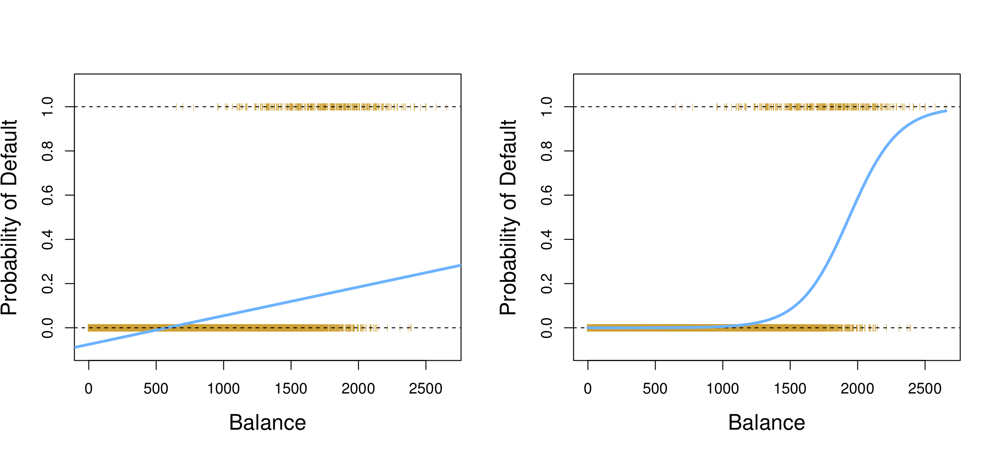

```{r setup, include=FALSE}
knitr::opts_chunk$set(echo = TRUE)
```

## Classification  
Predict a qualitative response for an observation based on $X$.

The 'Default' dataset:
<center>
{ width=45% } 
</center>
Fig. 4.1

## Classification  
Predict a qualitative response for an observation based on $X$.

The 'Default' dataset:
<center>
{ width=45% } 
</center>
Fig. 4.1

## Classification
- The test error rate is minimized on average by a simple classifier (the Bayes classifier) that *assigns each observation to the most likely class, given its predictor values.*  

- With 2 classes, Bayes decision boundary corresponds to predicting class one if $Pr(Y=1 | X=x_0) > 0.5$ and class two otherwise.

<center>
{ width=50% }
</center>
ISL Fig. 2.13; Purple dashed line: Bayes decision boundary

<!-- ## Model Accuracy in Classification -->

<!-- - Test error is given by $$\text{Avg}(I(y_0 \ne \hat y_0)) $$ where $I(y_0 \ne \hat y_0) = 1$ if $y_0 \ne \hat y_0$ but 0 otherwise. -->

## Classification 
In reality, we never know the conditional probability of $Y$ given $X$! The Bayes Classifier boundary is therefore an unattainable 'gold standard'. But, we can estimate it using various methods (logistic regression, KNN classification, LDA, QDA).

## Linear regression?  
What if we choose 

\[Y =
    \begin{cases}
      0 & \text{if Default = No}\\
      1 & \text{if Default = Yes}\\
    \end{cases}\]

fit a linear regression model, and predict 'Yes' if $\hat{Y} > 0.5$ and 'No' otherwise.

## Why not linear regression?
- No natural ordering of response variables with >2 classes.
- Estimates fall outside [0,1].
<center>
{ width=60% }
</center>

## Logistic regression
- Instead of trying to predict $Y$, let’s try to predict $Pr(Y = 1|X)$, or $p(X)$ for short.

- Then, predict default = Yes if $p(X) > 0.5$.

- This threshold can be changed if we want to be more conservative

## Logistic regression
- With logistic regression, we consider the *log-odds* or *logit* transformation of the response, and model the log odds as a linear combination of the predictor variables:
\[\log\left(\dfrac{p(X)}{1-p(X)}\right) = \beta_0 + \beta_1X\]

## Logistic regression
- Consider the odds, written as: $\dfrac{p(X)}{1-p(X)}$
- e.g. if 1 in 5 people default, the probability of defaulting is 0.2.
- The odds of defaulting will be 1:4, since $p(X) = 0.2$ and $\dfrac{0.2}{1-0.2} = 1/4$

<!-- ## Logistic regression -->
<!-- - With logistic regression, we consider the *log-odds* or *logit* transformation of the response, and model the log odds as a linear combination of the predictor variables: -->
<!-- $$\log\left(\dfrac{p(X)}{1-p(X)}\right) = \beta_0 + \beta_1X$$  -->

## Logistic regression
By using the logit transformation, our function $p(X)$ takes on an S-shape:
<center>
{ width=100% }
</center>
Fig. 4.2

## Why this results in an *S*-shaped curve?
Start with the model that we fit for logistic regression:

\[\log\left(\dfrac{p(X)}{1-p(X)}\right) = \beta_0 + \beta_1X\]

Exponentiate and take multiplicative inverse of both sides:

\[\dfrac{1-p(X)}{p(X)} = \dfrac{1}{e^{\beta_0+\beta_1X}}\]

Partial out fraction and add 1 to each side:

\[\dfrac{1}{p(X)} = 1 + \dfrac{1}{e^{\beta_0+\beta_1X}}\]


## Why this results in an *S*-shaped curve?
\[\dfrac{1}{p(X)} = 1 + \dfrac{1}{e^{\beta_0+\beta_1X}}\]

Change 1 to a common denominator:

\[ \dfrac{1}{p(X)} =\dfrac{1 + e^{\beta_0+\beta_1X}}{e^{\beta_0+\beta_1X}}\]

Take multiplicative inverse of both sides:

\[p(X) = \dfrac{e^{\beta_0+\beta_1X}}{1 + e^{\beta_0 + \beta_1X}}\]

## Why this results in an *S*-shaped curve?
This is the form of the logistic function:

\[S(x) = \dfrac{e^x}{ 1+ e^x}\]

<center>
{ width=70% }
</center>

## Estimating coefficients
- With logistic regression, we consider the *log-odds* or *logit* transformation of the response, and model the log odds as a linear combination of the predictor variables:

\[\log\left(\dfrac{p(X)}{1-p(X)}\right) = \beta_0 + \beta_1X\]

- How did we estimate $\beta_0$ and $\beta_1$ for linear regression (Chp. 3)?

## Estimating coefficients
  - For logistic regression, we use *maximum likelihood* to choose $\beta_0$ and $\beta_1$ such that the predicted probability $\hat{p}(x_i)$ of the response for each individual is as close as possible to the observed response.

  - $\beta_0$ and $\beta_1$ are chosen to *maximize* the likelihood function (ISL p. 133).

## Fitting a logistic regression model
```{r echo=T}
library(ISLR)
data(Default)
summary(glm(default ~ balance, data=Default, family = binomial))
```

## Interpreting the coefficients:

$\beta_1$:

  - For every one unit increase in 'balance', the expected change in the log odds is 0.005.

  - For every one unit increase in 'balance', we expect $e^{0.0055} = 1.0055$ or ~0.55% increase in odds of defaulting on a credit card payment.

Great discussion of interpreting coefficients on UCLA Data Analysis Examples website! See [here](https://stats.idre.ucla.edu/other/dae/) for website or [here](https://stats.idre.ucla.edu/other/mult-pkg/faq/general/faq-how-do-i-interpret-odds-ratios-in-logistic-regression/) for logistic regression specifically

## Making predictions
Once we have estimated the regression coefficients, we can compute the probability of default for a person with a credit card balance of $2,000:

\[\widehat p(X) = \dfrac{e^{-10.651 + 0.0055\times2,000}}{1 + e^{-10.651 + 0.0055\times2,000}} = 0.586\]

## Fitting a logistic regression model
- Just as for linear regression, we can generalize logistic regression to the case of multiple predictors.

\[ p(X) = \dfrac{e^{\beta_0+\beta_1X + ... +\beta_pX_p}}{1 + e^{\beta_0 + \beta_1X+ ... +\beta_pX_p}}\]
NOTE: $p(X)$, the probability of $Y$ given $X$, is not the same as $p$, the number of predictors!!!

## Fitting a logistic regression model
```{r echo=F}
library(ISLR)
data(Default)
summary(glm(default ~ balance + student, data=Default, family = binomial))
```

## Fitting a logistic regression model

\[\widehat{Pr}(\textrm{default=Yes|student=Yes}) = \dfrac{e^{-10.75 + 0.0057\times2,000 + -0.71\times1}}{1 + e^{-10.75 + 0.0057\times2,000 + -0.71\times1}}\]

\[= 0.48\]

\[\widehat{Pr}(\textrm{default=Yes|student=No}) = \dfrac{e^{-10.75 + 0.0057\times2,000 + -0.71\times0}}{1 + e^{-10.75 + 0.0057\times2,000 + -0.71\times0}}\]

\[ = 0.66\]

Given the same credit card balance, a student is less likely to default on the payment than a non-student.

## A machine learning view on logistic regression

https://towardsdatascience.com/breaking-it-down-logistic-regression-e5c3f1450bd#6a7a

## Alternatives to logistic regression
- When classes are well-separated, parameter estimates for logistic regression can be unstable.

- If $n$ is small and distribution of the predictors is approximately normal in each of the classes, **linear discriminant** model is more stable than logistic regression.

- Extensions to >2 classes exist (e.g. multinomial logistic regression) but less popular

<!-- ## Non-parametric classification: KNN -->

<!-- $K$-Nearest Neighbors classification -->
<!-- <center> -->
<!-- { width=60% } -->
<!-- </center> -->
<!-- ISL Fig. 2.14. KNN decision boundary for $K$=3 -->

<!-- ## Non-parametric classification: KNN -->
<!-- Choosing appropriate level of flexibility -->
<!-- <center> -->
<!-- { width=90% } -->
<!-- </center> -->
<!-- ISL Fig. 2.16 -->

<!-- ## Non-parametric classification: KNN -->
<!-- Bias-variance trade-off -->
<!-- <center> -->
<!-- { width=70% } -->
<!-- </center> -->
<!-- ISL Fig. 2.17 -->