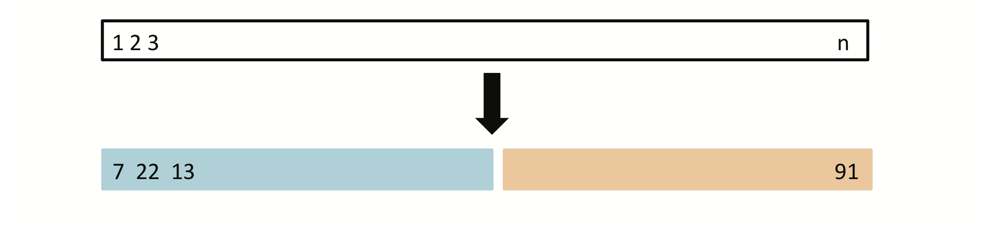
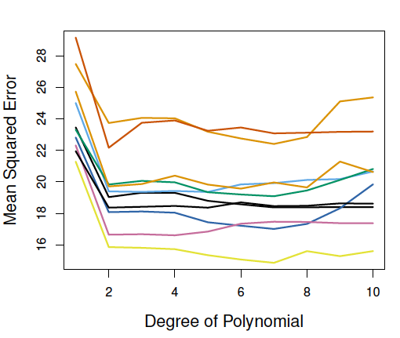
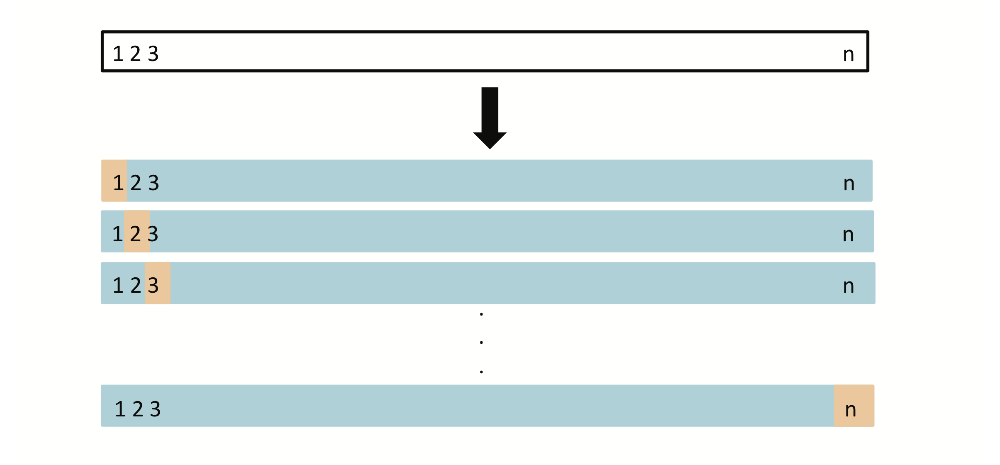
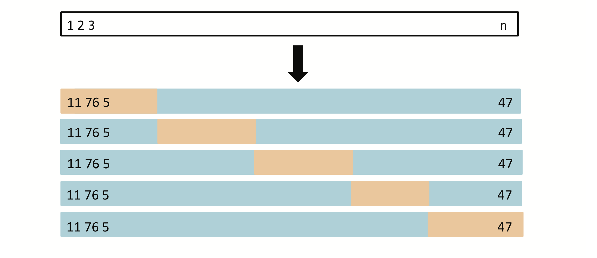
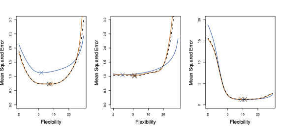
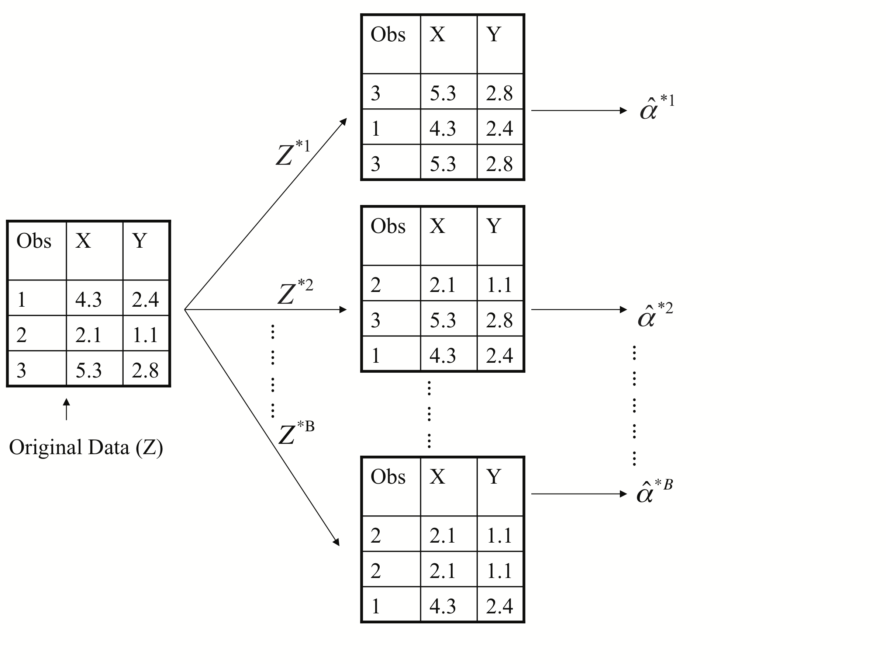
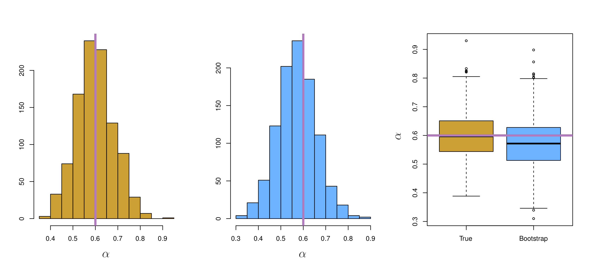

```{r setup, include=FALSE}
knitr::opts_chunk$set(echo = FALSE)
```

## What are resampling methods?  

Tools that involve *repeatedly* drawing samples from a training set and refitting a model on each sample. Can be used for:

- *Model Assessment:* estimate test error rates associated with a particular method    

- *Model Selection:* select the appropriate level of model flexibility for a model

- Determining accuracy of parameter estimate 

## Resampling Methods  
1.   Cross-Validation  
    - Validation Set Approach  
    - Leave-One-Out Cross-Validation  
    - *k*-fold Cross-Validation  

2.   Bootstrap  

## Cross-validation  
-  Often we don't have a large, designated test data set to directly estimate test error rate.

-  We can estimate test error by holding out a subset of training observations from the fitting process, and then applying the statistical learning method to the held out observations (validation set).   

## Validation set approach  
-  Randomly split the data into training and validation sets
-  Use the training set (blue) to fit the model
-  Use the validation set (orange) to estimate test MSE 

<center>
{ width=65% } 
</center>  
Fig. 5.1  

## Validation set approach  
Challenges:  

1. Estimate of test error rate can be highly variable, depending on which observations are in training vs. validation set.  
2. Model is trained on fewer observations.  
<center>
{ width=40% } 
</center>
Fig 5.2  

## Leave-One-Out Cross-Validation  
- Instead of creating two subsets of comparable size, LOOCV chooses one observation as the 'validation set', and all other observations to train the model.  
- This process is repeated *n* times.

<center>
{ width=65% } 
</center>  
Fig. 5.3   

## Leave-One-Out Cross-Validation  
- Less bias (almost all data used for training)  

- Estimate of test error rate is less variable than validation set approach 

- Computationally intensive (fit model *n* times)
    - 'Magic formula' can be used to estimate test error for least squares or polynomial regression  (ISL Equation 5.2)

## *k*-Fold Cross-Validation  
- Divide set of observations into *k* groups or folds of approximately equal size.  
- Hold out first fold as a validation set, and train model on remaining data.  
- Repeat *k* times.
- 5-fold and 10-fold CV often used.  

<center>
{ width=65% } 
</center>  
Fig. 5.5  

## Validation Set, LOOCV, *k*-Fold CV 
Which approach has lowest **Bias**?  

## Validation Set, LOOCV, *k*-Fold CV 
Which approach has lowest **Bias**?  

LOOCV < *k*-fold CV < Validation Set  

## Validation Set, LOOCV, *k*-Fold CV 
Which approach has lowest **Variance**?  

## Validation Set, LOOCV, *k*-Fold CV  
Which approach has lowest **Variance**?  

*k*-fold CV < LOOCV < Validation Set  

## Validation Set, LOOCV, *k*-Fold CV 
Which approach is most **computationally efficient?**  

## Validation Set, LOOCV, *k*-Fold CV   
Which approach is most **computationally efficient?**  

Validation Set < *k*-fold CV < LOOCV  (when not using the 'magic formula')  

## Points of clarification 
*k*-fold CV for regression vs. classification 

$$
CV_{(k)} = \frac{1}{k}\sum_{i=1}^kMSE_i 
$$

$$
CV_{(k)} = \frac{1}{k}\sum_{i=1}^kErr_i 
$$
where $Err_i = I(y_i \ne \widehat{y}_i)$

## Points of clarification
We need CV because we never know the true test error for unsimulated data. 

<center>  
{ width=65% } 
</center>  

Fig. 5.6: true (blue) and estimated test MSE for three simulated datasets. Test MSE estimated by LOOCV (black) and 10-fold CV (orange). 

## Bootstrap  
1. Rather than draw independent data sets from the population, obtain distinct data sets by repeatedly sampling from the original data set. 
    - Sampling with replacement: a single observation can occur more than once. 
  
2. With each of the *B* different data sets, fit model and generate estimate of parameter of interest.   

3. Estimate standard errors of parameters for a wide range of methods.  

## Bootstrap  
Bootstrap sampling process (Fig. 5.11)
<center>
{ width=80% } 
</center>

## Bootstrap  
A useful approach for quantifying uncertainty associated with a given estimator or method without generating large numbers of independent datasets. 
<center>
{ width=90% } 
</center>  
Fig. 5.10. Orange: $\alpha$ estimated from 1000 distinct data sets drawn from true population. Blue: $\alpha$ estimated from 1000 bootstrap samples from a single data set.       


## Reflection
1. What is the nature of the analysis you will/are carrying out for Report 2? 

    -  Simple linear regression? Multiple linear regression? Logistic regression with one or more predictors?
  
2. What do you think is the true shape of *f(x)* for your dataset/research question? Is a linear decision boundary (classification) or a linear relationship between *X* and *y* (regression) reasonable?   
  

