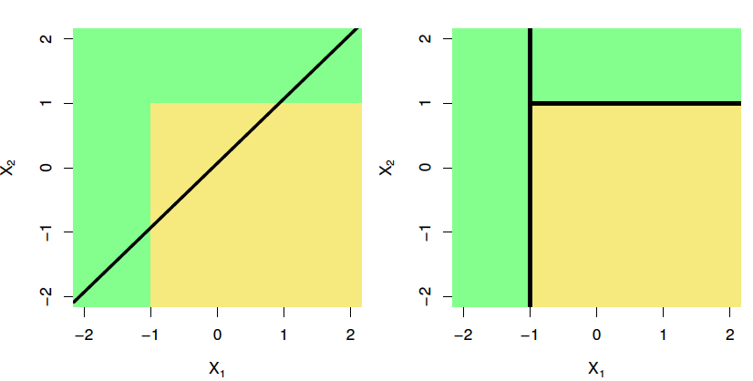
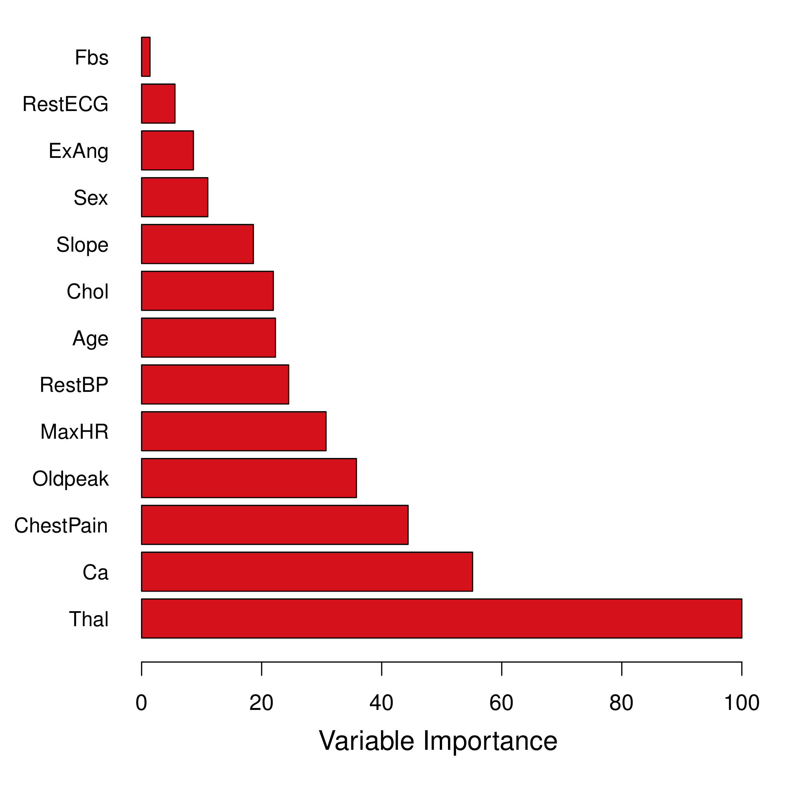
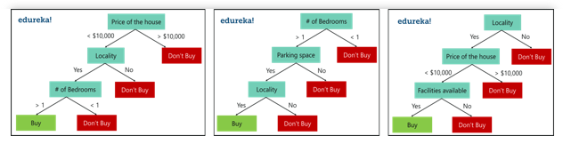
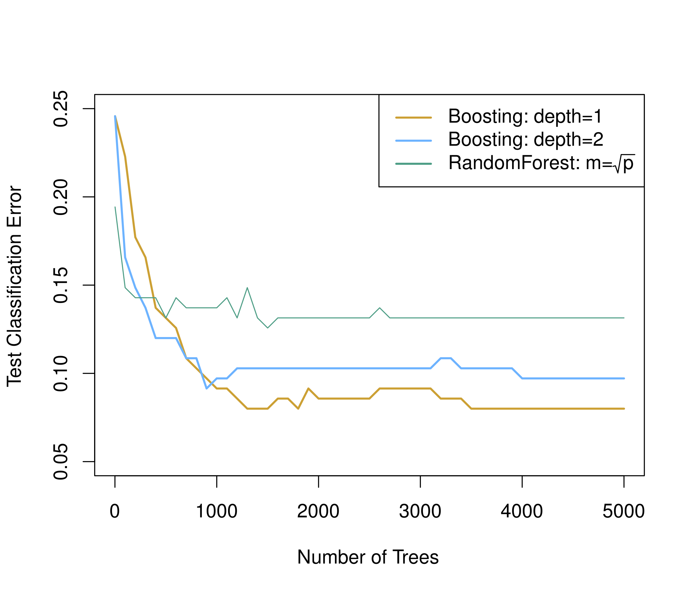

```{r setup, include=FALSE}
knitr::opts_chunk$set(echo = FALSE)
```

## Tree-Based Methods
- A different approach to classification or regression problems involves partitioning the predictor space into several distinct regions.

<center>
{ width=70% } 

</center>  


## Tree-Based Methods
- Can be useful when there is a highly non-linear and complex relationship between features and response.  
- Easy to interpret, visualize, and explain  
- *Individual decision trees do not have same same level of predictive accuracy as many other methods*  


## Outline
- Intro to Regression & Classification Trees 
- **Ensemble approaches** (combine many weak learners to form a strong learner):
  - Bagging
  - Random Forests
  - Boosting  

## Regression Trees   
Predicting the log-transformed salary of a baseball player based on # years in the major leagues and number of hits in the previous year.  

{ width=39%} { width=45% }  

Divide predictor space into several regions, and make the same prediction for every prediction that falls into region $R_j$.  

## Regression Trees: Terminology    
The R1, R2, and R3 regions are the **leaves** or **terminal nodes.**
The points where predictor space is split are the **internal nodes.**
**Branches** connect the nodes.  
<center>
{ width=40%}  
</center>

Note hierarchical relationship between predictors.  

## Regression Trees
1.  Where to split? i.e. how do we decide on what regions to use i.e. $R_1, R_2,...,R_j$ or equivalently what tree structure should we use?
2.  What values should we use for $\hat{Y_1}, \hat{Y_2}, .., \hat{Y_k}$?

## Regression Trees
**2. What values should we use for $\hat{Y_1}, \hat{Y_2}, .., \hat{Y_k}$?**

For region $R_j$, the best prediction is simply the average of all the responses from our training data that fell in region $R_j$.

## Regression Trees
**1. Where to split?**
Infeasible to consider every possible partition of feature space...

**Recursive binary splitting**: top-down, greedy approach.  Starting at the top of the tree (all observations in a single region), successively split predictor space according to the best split at that particular step.  

## Regression Trees
Select predictor $X_j$ and cutpoint $s$ such that splitting the predictor space into regions $R_1(j,s) = \{X|X_j < s\} \text{ and }R_2(j,s) = \{X|X_j > s\}$ leads to the greatest possible reduction in RSS.  

## Regression Trees  
So, we seek the value of $j$ and $s$ that minimize $$\sum_{i:x_i \in R_1(j,s)}(y_i - \hat{y}_{R_1})^2 + \sum_{i:x_i \in R_2(j,s)}(y_i - \hat{y}_{R_2})^2$$  

Repeat, this time splitting one of the two previously identified regions instead of the entire predictor space, until a stopping criteria reached (e.g. no region contains more than five observations). 

## Regression Trees  
Which set of partitions could result from recursive binary splitting?  
<center>
{ width=60%}  
</center>


<!-- ## Regression Trees -->
<!-- Complex trees with many splits may lead to lower bias but higher variance.  To reduce overfitting, we can **prune** the trees to produce smaller **subtrees**. -->


<!-- Estimating cross-validation error is computationally intensive. We can select a small subset of trees for consideration using **cost complexity pruning**. -->


<!-- ## Regression Trees   -->
<!-- **Cost complexity pruning**: -->
<!-- Consider a non-negative tuning parameter, $\alpha$. Each $\alpha$ corresponds to a subtree $T \subset T_0$ such that  -->
<!-- $$\sum_{m=1}^{|T|} \sum_{x_i\in R_m}(y_i - \hat{y}_{R_m}) + \alpha|T|$$  -->
<!-- where |T| is the number of terminal nodes of tree $T$ and $R_m$ is the region corresponding to the $m$th terminal node.   -->

<!-- We can use cross validation to see which tree has the lowest error rate. -->

## Classification Trees  
For each region (or node) we predict the most common category among the training data within that region.

## Classification Trees 
Splits are chosen the same way as with a regression tree except that minimizing MSE no longer makes sense.

There are several possible different criteria to use such as the “Gini index” and “cross-entropy” but the easiest one to think about is to minimize the classification error rate.

## Ensemble Trees  
Although decision trees are easy to understand, they can have high variance and poor prediction accuracy.  More powerful prediction models can be constructed using ensemble tree methods.  

## Bagging  
**Bootstrap aggregation** or **bagging** is often used for decision trees. For a given observation, we average the prediction (regression) or take a majority vote (classification) from $B$ trees constructed using $B$ bootstrapped training sets.

## Bootstrapping  
Each bootstrap dataset is obtained by random sampling with replacement from the original dataset.  
<center>
{ width=70%} 

</center>  

## Bagging 
- Grow trees deep (no pruning)
- Each tree has low bias but high variance, but the variance is reduced when trees are averaged.  
- The number of trees, $B$, is usually not too critical. Just pick a sufficiently large value so error is reduced. 
- **Out-of-bag error** can be estimated using the ~1/3 of observations that are not used to grow the tree for each bootstrap dataset.  

## Bagging  
- We can no longer easily interpret a single tree, but we can determine measures of **variable importance**. For example, the total amount that the RSS (regression) or Gini index (classification) is decreased due to splits over a given predictor, averaged over all $B$ trees.  

<center>
{ width=40%} 
</center>

## Random Forests  
- Improves on bagging because it decorrelates the trees. 

- RF also builds trees from bootstrapped training samples, but instead of all $p$ predictors, each time a split in a tree is made, only a random sample of $m$ predictors is considered.  

- Usually $m \approx  \sqrt p$.  


## Random Forests  
If there is one very strong predictor, it is excluded from some of the trees so the trees don't all look the same (*i.e.* with the same predictor near the root.

<center>
{ width=100%} 

</center>

## Boosting  
Like bagging, boosting is a general approach that can be applied to many statistical learning methods.  

But, boosting does not involve bootstrapping.  

Instead, trees are grown sequentially and the model learns slowly.  For regression trees, given the current model, we fit a decision tree to the residuals.  Then add this new tree to the fitted function in order to update the residuals.

Each tree can be rather small, with just a few terminal nodes, determined by the parameter $d$.

## Boosting Algorithm   
1. Set $\hat{f}(x) = 0$ and $r_i = y_i$ for all $i$ in the training set.  
2. For $b = 1, 2, ..., B,$ repeat: 
<ol type="a">
  <li>Fit a tree $\hat{f}^b$ with $d$ splits ($d + 1$ terminal nodes) to the training data $(X,r)$.</li>
  <li>Update $\hat{f}$ by adding in a shrunken version of the new tree: $$\hat{f}(x) \leftarrow \hat{f}(x) + \lambda\hat{f}^b(x).$$</li>
  <li>Update the residuals, $r_i \leftarrow r_i - \lambda \hat{f}^b(x_i)$</li>
</ol>
3. Output the boosted model, $\hat{f}(x) = \sum_{b=1}^B \lambda \hat{f} ^b(x)$

## Boosting  
Tuning parameters:  

1. Number of trees, $B$.  Can overfit if $B$ is large.  Use cross-validation! 

2. The shrinkage parameter, $\lambda$, a small positive number. Controls the rate at which boosting learns.  

3. The number of splits, $d$.  Often boosting with stumps ($d=1$) works well.

## Boosting  
Example with cancer gene expression dataset:  
<center>
{ width=70%} 

</center>

