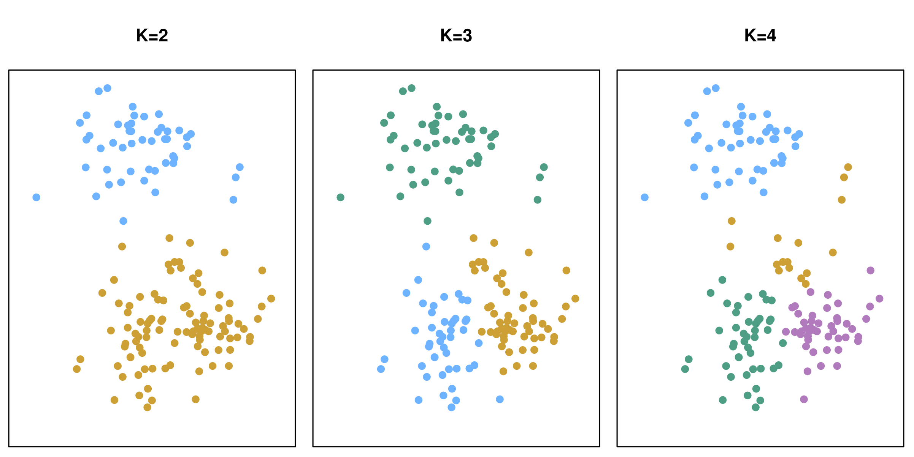
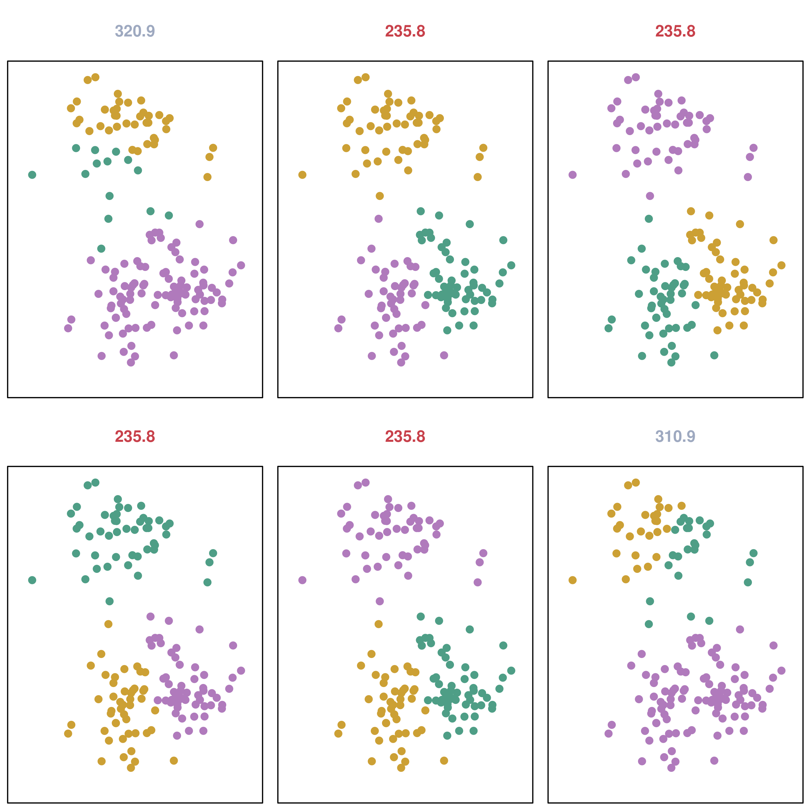
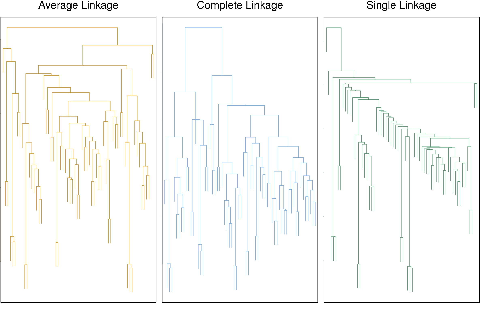
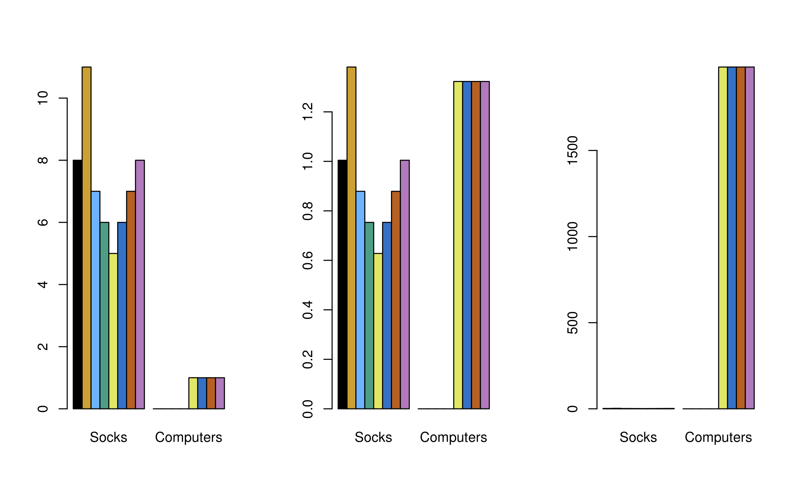

```{r setup, include=FALSE}
knitr::opts_chunk$set(echo = FALSE)
```

## Clustering  
PCA tries to find a low-dimensional representation of the observations that explain a large fraction of variation.

Clustering tries to find homogeneous subgroups among the observations.  

## *K*-Means Clustering  
Goal: partition a data set into *K* distinct, non-overlapping clusters, where $C_1, ..., C_K$ denote sets containing indices of the observations in each cluster.  

These sets satisfy two properties:

1. Each observation belongs to at least one of the *K* clusters \[C_1\cup\ C_2  \cup\ ...\ \cup\ C_K = \{1, ..., n\}\]

2. No observation belongs to more than one cluster \[C_k \cap\ C_{k'} = \emptyset \text{ for all }k\ne k' \]

## *K*-Means Clustering
<center>
{ width=90%}
</center>
ISL Fig. 12.7: Cluster labels in this figure are not used in clustering; they are outputs of the clustering procedure.

## *K*-Means Clustering
We want to choose clusters so the within-cluster variation is minimized:
\[
\begin{aligned}
& \underset{C_1, ...,C_K}{\text{minimize}}
& & {\left\{\sum_{k=1}^{K}W(C_k)\right\}}  \\
\end{aligned}
\]
where $W(C_k)$ is the within-cluster variation for cluster $C_k$.

## *K*-Means Clustering
One way to define $W(C_k)$ is using the squared Euclidean distance:
\[W(C_k) = \dfrac{1}{\lvert C_k\rvert}\sum_{i,i'\in C_k}\sum_{j=1}^p(x_{ij} - x_{i'j})^2,\]
where $\lvert C_k\rvert$ denotes the number of observations in the *k*th cluster.

## *K*-Means Clustering
These two equations are then combined to give the optimization problem for *K*-means clustering:
\[
\begin{aligned}
& \underset{C_1, ...,C_K}{\text{minimize}}
& & {\left\{\sum_{k=1}^{K}\dfrac{1}{\lvert C_k\rvert}\sum_{i,i'\in C_k}\sum_{j=1}^p(x_{ij} - x_{i'j})^2\right\}}  \\
\end{aligned}
\]

## *K*-Means Clustering
This is a difficult problem since there are ~ $K^n$ ways to partition *n* observations into *K* clusters.  The follwing algorithm can be used to approximate a solution:

1. Randomly assign a number from 1 to *K* to each of the observations to give initial cluster assignments.

2. Iterate until the cluster assignments stop changing:
    a. For each of the *K* clusters, compute the cluster centroid. The *k*th cluster centroid is the vector of the *p* feature means for the observations of the *k*th cluster.
    b. Assign each observation to the cluster whose centroid is closest as determined using the Euclidean distance.

## *K*-Means Clustering
<center>
{ width=70%}
</center>
ISL Fig. 12.8

## *K*-Means Clustering
The algorithm finds a *local* rather than *global* optimum, results depend on initial cluster assignments.

The algorithm can be run multiple times with different initial configurations and one can select the best solution of these.

<center>
{ width=50%}
</center>

## Hierarchical Clustering
Hierarchical clustering is an alternative approach that does not require us to pre-specify *K*.

The most common type of hierarchical clustering is bottom-up (agglomerative) clustering.

## Hierarchical Clustering
1. Begin with *n* observations and a measure of all the $\binom{n}{2} = n(n-1)/2$ pairwise dissimilarities. Treat each observation as its own cluster.
2. For $i = n, n-1, ..., 2$:
    - Examine all pairwise inter-cluster dissimiliarites among the $i$ clusters and identify the pair of clusters that are most similar. Fuse these two clusters. The dissimilarity between these two clusters indicates the height in the dendrogram at which the fusion should be placed.
    - Compute the new pairwise inter-cluster dissimilarities among the $i - 1$ remaining clusters.

## Hierarchical Clustering
The lower in the tree fusions of leaves occur, the more similar the observations are to each other; the closer to the top of the tree fusions occur, the more different.

<center>
{ width=90%}
</center>

ISL Fig. 12.11: Dendrograms obtained from 45 observations simulated from 3 classes with complete linkage and Euclidean distance, cut at different heights.

## Hierarchical Clustering
Similarity of two observations must be determined based on their location on the *vertical* not *horizontal* axis.

<center>
{ width=90%}
</center>
ISL Fig. 12.12

## Hierarchical Clustering
How to determine dissimilarity between *groups* of observations (linkage)?

**Complete linkage**: Compute all pairwise dissimilarities b/w observations in cluster A and cluster B, and record the *largest* dissimilarity.

**Single linkage**: Compute all pairwise dissimilarities b/w observations in cluster A and cluster B, and record the *smallest* dissimilarity. Can lead to less balanced clusters.

**Average linkage**: Compute all pairwise dissimilarities b/w observations in cluster A and cluster B, and record the *average* dissimilarity.

**Centroid**:  Dissimilarity between the centroid for cluster A and B.  Can suffer from inversion where two clusters are fused at a height below one of the individual clusters.

## Hierarchical Clustering
<center>
{ width=90%}
</center>
ISL Fig. 12.14. Average and complete linkage tend to yield more balanced clusters.

## Dissimilarity Measure in Hierarchical Clustering
Consider case of clustering shoppers based on past shopping history.  If Euclidean distance is used, shoppers who have bought very few items overall will cluster together.

We can choose a different similarity measure (e.g. correlation-based distance, which considers two observations to be similar if their features are highly correlated)

<center>
{ width=70%}
</center>

Fig. 12.16

## Scaling in Clustering
In the shopping example, some items may be purchased more frequently and have a larger effect on the inter-shopper dissimilarities.

<center>
{ width=80%}
</center>
ISL Fig. 10.14. Left: Number of socks and computers purchased by each shopper. Center: Each variable scaled by standard deviation. Right: Same data, shown as $ spent by each shopper.

## Issues
**PCA**:

- Choice of # of PCs to retain is somewhat subjective

**Clustering**:

- Validating the clusters

- Outliers (mixture models, see Hastie et al. 2009)

- Sensitive to perturbations of the data

- Should observations or features be standardized? (e.g. centered w/mean 0 and scaled to have s.d. 1?)

## Issues

*K-means*:

  - How many clusters should we look for?

*Hierarchical clustering:*

  - Where to 'cut' the dendrogram?

  - What type of linkage & dissimilarity measure should be used?

