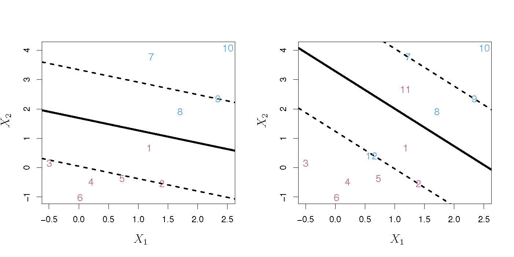
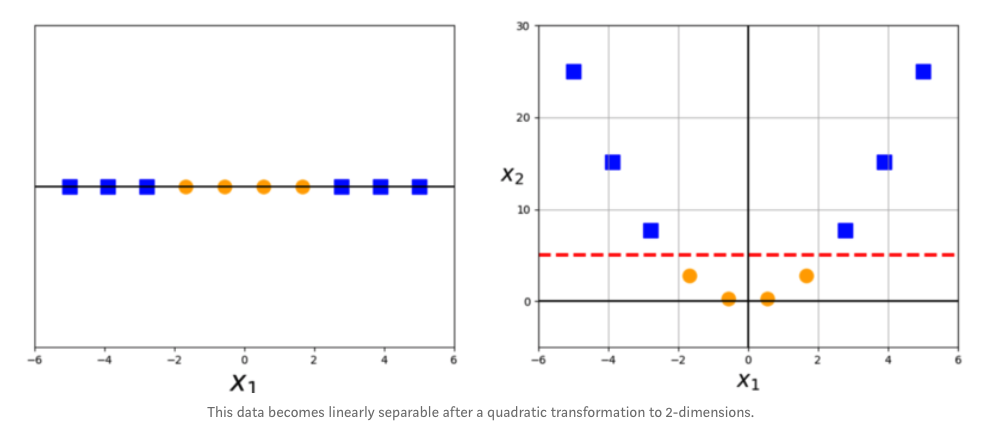
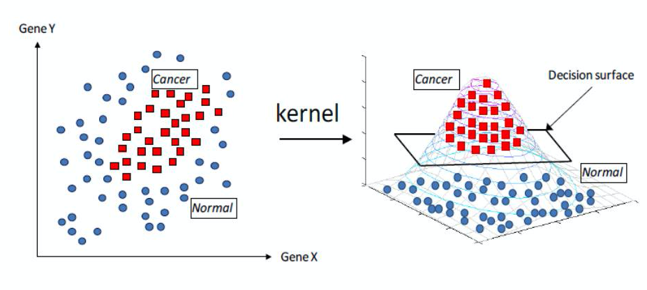

```{r setup, include=FALSE}
knitr::opts_chunk$set(echo = FALSE)
```
## Support Vector Machines  
- Developed in the 1990s 
- One of the best "out of the box" classifiers  

## Outline  
- Maximal Margin Classifier (SVMs are a generalization of MMCs)  
- Support Vector Classifier (extension of MMCs to non-separable cases)
- Support Vector Machines (further extension of SVCs to accomodate non-linear boundaries)

## Hyperplane    
*Hyperplane*: a flat affine subspace of dimension $p-1$. (Subspace need not pass through the origin).

In 2-D: a flat one-dimensional subspace (a line)
$$\beta_0 + \beta_1X_1 + \beta_2X_2 = 0$$
In 3-D: a flat two-dimensional subspace (a plane)
$$\beta_0 + \beta_1X_1 + \beta_2X_2 + \beta_3X_3= 0$$

In $p$-D: difficult to visualize
$$\beta_0 + \beta_1X_1 + \beta_2X_2 +...+\beta_pX_p= 0$$

## Hyperplane    
<center>
{ width=50%}

</center>
$$1 + 2X_1 + 3X_2 = 0$$
blue points: $$1 + 2X_1 + 3X_2 > 0$$
pink points: $$1 + 2X_1 + 3X_2 < 0$$

## Separating Hyperplanes  
We can use a separating hyperplane to construct a classifier: a test observation is assigned a class depending on which side of the hyperplane it is located.  
<center>
{ width=100%}

</center>

## Maximal Margin Classifier  
If the data can be linearly separated, infinite possible hyperplanes exist.

The *maximal margin hyperplane* is the separating hyperplane that is farthest from the training observations (has the largest *margin*).  

(We compute the distance from each observation to the hyperplane and consider the smallest distance as the *margin*.) 

A classifier based on this hyperplane is the *maximal margin classifier*.

## Maximal Margin Classifier  
*Support vectors* are vectors in $p$-dimensional space that 'support' the maximal margin hyperplane. *The maximal margin hyperplane depends only on a subset of observations.*
<center>
{ width=50%}

</center>

## Maximal Margin Classifier  
The maximal margin classifier is the solution to: 
\begin{equation*}
\begin{aligned}
& \underset{\beta_0, \beta_1, ..., \beta_p, M}{\text{maximize}}{M} \\
& {\text{subject to}\sum_{j=1}^p\beta_j^2=1,} \\
& {y_i(\beta_0 + \beta_1X_{i1} + \beta_2X_{i2} + ... + \beta_pX_{ip})\ge M\ \forall\ i = 1,...,n}
\end{aligned}
\end{equation*}

where $M$ is the margin of the hyperplane and $y_i, ..., y_n \in \{-1, 1\}$


## Support Vector Classifiers 
Using a *soft-margin*, we can identify a hyperplane that *almost* separates the classes. This can be desirable if  
1. No separating hyperplane exists.  
2. We want to reduce sensitivity to individual observations.  

<center>
{ width=50%}

</center>

## Support Vector Classifier  
The support vector classifier is the solution to: 
\begin{equation*}
\begin{aligned}
& \underset{\beta_0, \beta_1, ..., \beta_p, \epsilon_1, ..., \epsilon_n, M}{\text{maximize}}{M} \\
& {\text{subject to}\sum_{j=1}^p\beta_j^2=1,} \\
& {y_i(\beta_0 + \beta_1X_{i1} + \beta_2X_{i2} + ... + \beta_pX_{ip})\ge M(1-\epsilon_i)} \\
& {\epsilon_i\ge0, \sum_{i=1}^n\epsilon_i\le C,}
\end{aligned}
\end{equation*}

where $C$ is a nonnegative tuning parameter and $\epsilon_1,...,\epsilon_n$ are slack variables that allow individual observations to be on the wrong side of the margin or the hyperplane.  

## Support Vector Classifier  
$\epsilon_i=0$: $i$th observation on correct side of **margin**  

$\epsilon_i>0$: $i$th observation on wrong side of **margin**  

$\epsilon_i>1$: $i$th observation on wrong side of **hyperplane** 

## Support Vector Classifier  
<center>
{ width=100%}

</center>

What happens as C increases?

## Support Vector Classifier  
Only the observations on the margin or on the wrong side of the margin (support vectors) will affect the hyperplane. 

## Outline  
- Maximal Margin Classifier
- Support Vector Classifier (extension of MMCs to non-separable cases)
- **Support Vector Machines (further extension of SVCs to accomodate non-linear boundaries)**

## 
{ width=100%}

## Support Vector Machines  
Use *kernels* to enlarge feature space and accommodate non-linear boundaries between the classes.

<center>

{ width=100%}

</center> 

## Support Vector Machines  
Use *kernels* to enlarge feature space and accommodate non-linear boundaries between the classes.

<center>

{ width=90%}

## Kernel  
A function that quantifies the similarity of two observations.  

$$K(x_i, x_{ij})$$

## Kernel  
The function for a support vector classifier can be written as 
$$f(x) = \beta_o + \sum_{i\in S}\alpha_i K(x,x_i)$$
where $S$ is the collection of indices of the support vectors  

## Linear Kernel  
- Quantifies the similarity of a pair of observations using Pearson correlation 

$$K(x_i, x_{i'}) = \sum_{j=1}^p x_{ij}x_{i'j}$$  

- **This just gives us the Support Vector Classifier**  


## Polynomial Kernel  
- Fits a support vector classifier in higher-dimensional space involving polynomials of degree $d$ rather than in the original feature space.  

$$K(x_i, x_{i'}) = (1 +\sum_{j=1}^p x_{ij}x_{i'j})^d$$  

- **An SVC with a non-linear kernel such as the polynomial kernel is known as a support vector machine.**

## Polynomial Kernel  
SVM with polynomial kernel of degree 3: 
<center>

{ width=60%}

</center>

## Radial Kernel 
Another non-linear kernel is the radial kernel: 
$$K(x_i, x_{i'}) = \exp(-\gamma\sum_{j=1}^p (x_{ij}x_{i'j})^2)$$   

## Radial Kernel  
SVM with radial kernel: 
<center>

{ width=60%}

</center>

## SVMs with >2 classes  
- One-vs-one: construct ${K \choose 2}$ SVMs, each of which compares a pair of classifiers

- One-vs-all: construct $K$ SVMs, each of which compares the $k$th class to all others.  

## Summary  
- SVMs use a kernel function to enlarge the feature space and accommodate non-linear class boundaries.  

- Linear, polynomial, and radial kernels can be used.  
