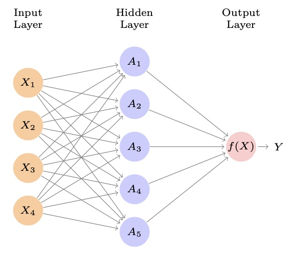
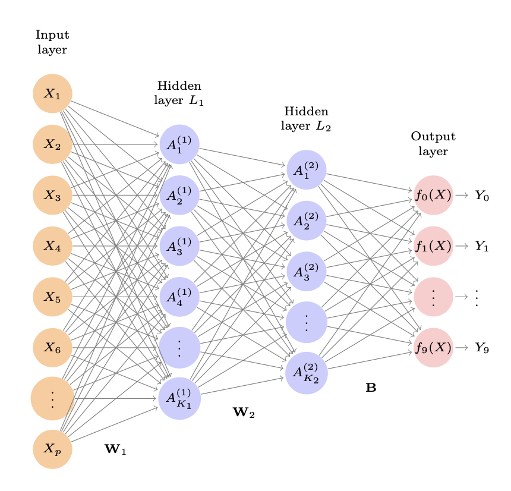
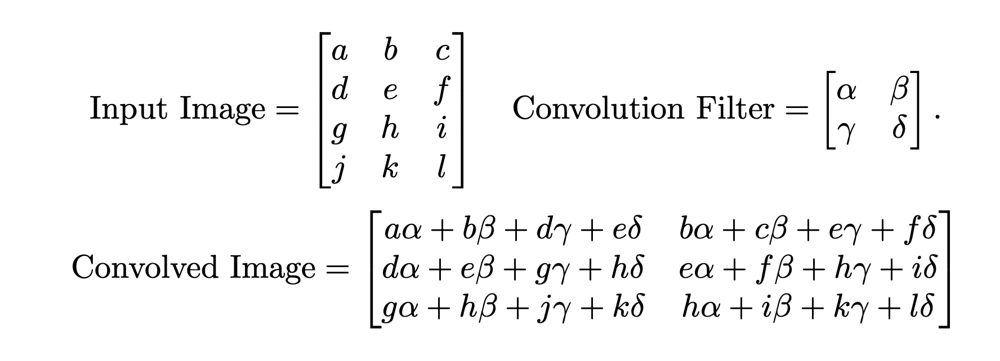
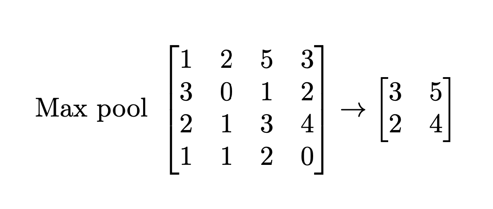

```{r setup, include=FALSE}
knitr::opts_chunk$set(echo = FALSE)
```

## Deep Learning 
- Single Layer Neural Networks
- Multilayer Neural Networks
- Convolutional Neural Networks 

## Single Layer Neural Network 
A neural network takes an input vector of $p$ variables $X = (X_1, X_2, ..., X_p)$ and builds a nonlinear function $f(X)$ to predict the response $Y$. 


## Single Layer Neural Network
1. Activations ($A_k$) in the hidden layer are computed as functions of the input features $X_1, ..., X_p$:
\[A_k = h_k(X) = g(w_{k0} + \sum_{j=1}^{p}w_{kj}X_j)\] where $g(z)$ is a nonlinear activation function.

2. These $k$ activations then feed in to the output layer: \[f(X) = \beta_0 + \sum_{k=1}^{K}\beta_kA_k\] (This is just a linear regression model of the $K$ activations!)  

## Single Layer Neural Network 
<center>
{ width=70%}

</center>

## Activation Functions, $g(z)$
- Sigmoid \[g(z) = \frac{e^z}{1 + e^z} = \frac{1}{1 + e^{-z}} \]
We already used this for logistic regression to convert a linear function into probabilities between 0 and 1!


- ReLU (rectified linear unit) \[g(z) = (z)_+ = \begin{cases}
0 & \text{if $z < 0$}\\
z & \text{otherwise.}\\
\end{cases}
\]

## Activation Functions, $g(z)$ 
Values of $A_k = h_k(X)$ close to one are firing, while those close to zero are silent. These non-linear activations allow the model to capture complex nonlinearities and interaction effects.  
<center>
{ width=70%}

</center> 

## Activation Functions, $g(z)$ 
Rotation (linear transformations) + Squashing (non-linear transformations)!

\[A_k = h_k(X) = g(w_{k0} + \sum_{j=1}^{p}w_{kj}X_j)\]

Check out the video [here](https://www.youtube.com/watch?v=0TdAmZUMj2k&list=PLLHTzKZzVU9e6xUfG10TkTWApKSZCzuBI&index=3) by Alfredo Canziani for the NYU Deep Learning course. The whole course (http://bit.ly/DLSP21-home) is awesome! 

## Fitting a Neural Net 
Need to estimate $\beta$ and $w$ parameters in:
\[f(X) = \beta_0 + \sum_{k=1}^K\beta_kg(w_{k0} + \sum_{j=1}^{p}w_{kj}X_j)\] 

To do this, we fit the model using gradient descent. Using labels from a training set, we choose the parameters to minimize \[\sum_{i=1}^n(y_i - f(x_i))^2.\] 

## Multilayer Neural Networks 
<center>
{ width=60%} 
</center> 

Input layer with $p$ = 784 units and two hidden layers ($K_1 = 256$ units, $K_2 = 128$ units). **Why 10 output units?** 

## Multilayer Neural Networks 
<center>
{ width=60%} 
</center> 

Input layer with $p$ = 784 units and two hidden layers ($K_1 = 256$ units, $K_2 = 128$ units). $W_1$ is a 785 x 256 matrix of weights. **Why 785?**  

## Multilayer Neural Networks 
The second hidden layer treats the activations $A_k^{(1)}$ of the first hidden layer as inputs and computes new activations:

\[A_l^{(2)} = h_l^{(2)}(X)\]
\[ = g(w_{l0}^{(2)} + \sum_{k=1}^{K_1}w_{lk}^{(2)}A_k^{(2)})\]

## Multilayer Neural Networks 
In the output layer we also now have multiple outputs rather than one. We compute ten different linear models for $m = 0, 1, ..., 9$ \[Z_m = \beta_{m0} + \sum_{l=1}^{K_2}\beta_{ml}A_l^{(2)}\]

We then apply the *softmax* activation function so that the ten numbers can be interpreted as probabilities. \[f_m(X) = Pr(Y = m|X) = \frac{e^{Z_m}}{\sum_{l=0}^9e^{Z_l}}\]

## Convolutional Neural Networks 
Neural networks became popular for image recognition in the 1980s but fell out of favor after that when SVMs, random forests, and boosting gained steam. They resurfaced after 2010 when large training databases started to become available. 

<center>
{ width=100%} 
</center> 
CIFAR100: 60,000 32x32 pixel images in three channels 

## Convolutional Neural Networks 
"The world is compositional." 
-- Yann LeCun 
<right>
{ width=30%} 
</right> 

<center>
{ width=60%} 
</center> 

Convolutional Neural Networks learn hierarchical representations by extracting low-, mid-, and high-level features.


## Convolutional Neural Networks 
CNNs use two specialized types of hidden layers to build up this hierarchy: 1) convolution layers and 2) pooling layers.

## Convolution Layers 
Made up of a large number of convolution filters, each of which is a template that determines whether a particular local feature is present in an image. 

<center>
{ width=100%} 
</center> 

## Convolution Layers 
If a a 2x2 submatrix of the original image resembles the convolution filter, will it have a large or small value in the convolved image?

<center>
{ width=100%} 
</center> 

## Convolution Layers 
**The convolved image highlights regions of the original image that resemble the convolution filter.**

<center>
{ width=100%} 
</center> 

## Convolution Layers 
- For a color image, a single filter will also have three channels, with potentially different weights. The results are summed into a 2-D feature map. 
- So, if use $K$ different convolution layers in the first hidden layer, we get $K$ 2-D output feature maps but these are considered as a single 3-D feature map ($K$ channels).
- The ReLU activation function is often used for the convolved image. 

## Pooling Layers 
Used to condense a large image into a smaller summary image. 
<center>
{ width=100%} 
</center>

Max pooling produces some *location invariance.* 

## Putting it all together 
<center>
{ width=100%} 
</center>

Convolution layers are interspersed with 2x2 max pool layers, before the 3-D feature maps are flattened (pixel maps treated as separate units) and fed into a fully-connected layer before reaching the output layer (a soft-max activation for 100 classes). 
