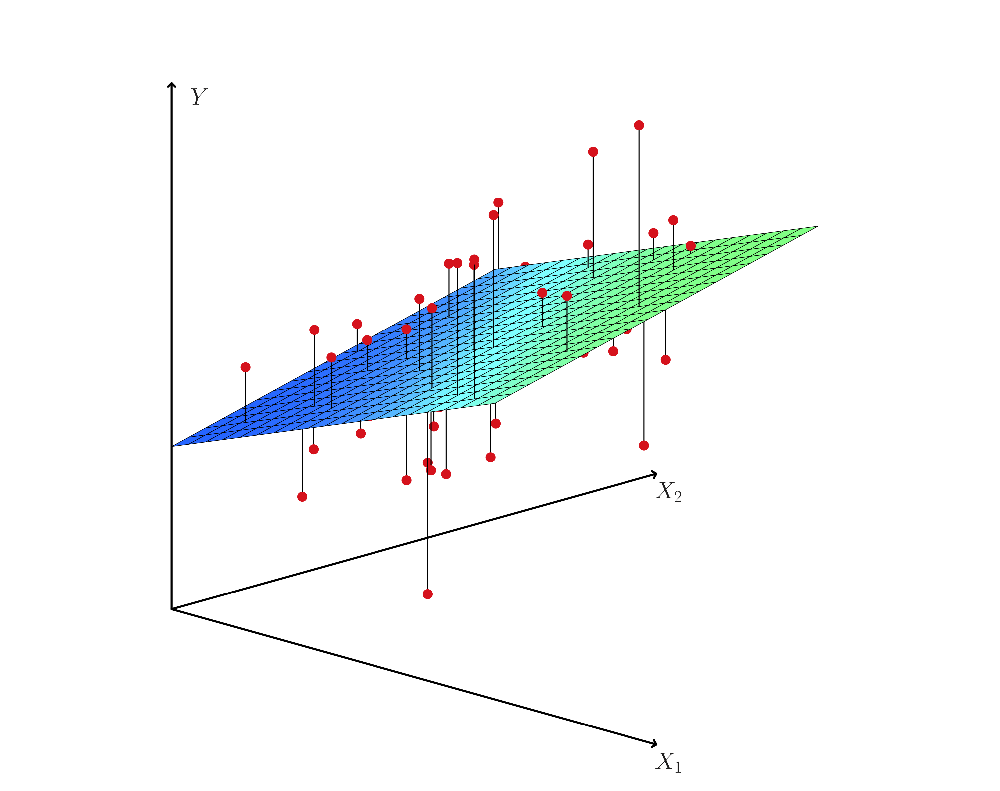
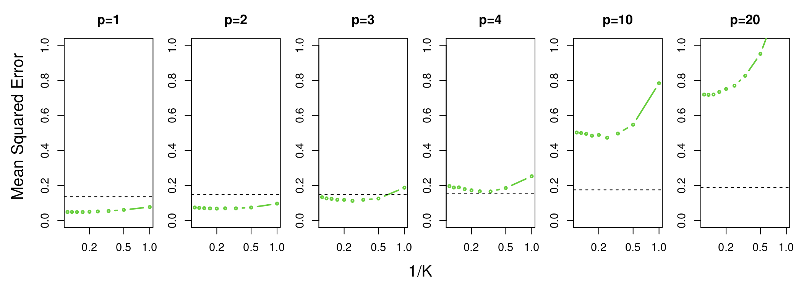

```{r setup, include=FALSE}
knitr::opts_chunk$set(echo = TRUE)
```

## Outline

**Regression** 

+ Linear Regression  

+ Non-parametric approach (KNN Regression)  

+ Considerations in High Dimensions

+ Lab 3

## Advertising dataset  
Describes sales (in thousands of units) as a function of advertising budgets (in thousands of dollars) for TV, radio, and newspaper for $n$ = 200 different markets.  

<center>
{ width=100% }
</center>

## Questions you can answer with linear regression:  

+ Is there a relationship between predictor(s) and response? 

+ How strong is this relationship?  

+ Which predictors contribute to the response?

+ How accurately can we estimate the effect of each predictor?

+ How accurately can we predict the response?

+ Is the relationship linear?

+ Is there synergy among predictors?

## Simple Linear Regression
Predict a quantitative response $Y$ on the basis of a single predictor $X$.  

$$sales \approx \beta_0 + \beta_1 \times TV$$
Use training data to produce estimates for the model coefficients, $\widehat\beta_0$ and $\widehat\beta_1$.

## Estimating the Coefficients    
Most common approach to produce coefficient estimates $\widehat\beta_0$ and $\widehat\beta_1$ is to minimize the *least squares* criterion.  

## Estimating the Coefficients      
Consider the least squares fit for regression of $sales$ onto $TV$:  
<center>
{ width=80% }
</center>
Fig. 3.1

## What does each grey line represent?   

A. the $i$th residual   

B. $y_i - \widehat y_i$    

C. error of the $i$th observation  

D. squared error of the $i$th observation  

E. residual sum of squares  

## Estimating the Coefficients   
The residual sum of squares (RSS) is given by:
$$RSS = e_1^2 + e_2^2 + ... + e_n^2$$
where $e_i= y_i - \widehat y_i$ represents the $i$th residual and $\widehat y_i = \widehat\beta_0 + \widehat\beta_1x_i$.

<!-- $$RSS = (y_1 - \widehat\beta_0 -\widehat\beta_1x_1)^2 + (y_2 - \widehat\beta_0 -\widehat\beta_1x_2)^2 $$ -->
<!-- $$+ ... + (y_n - \widehat\beta_0 -\widehat\beta_1x_n)^2$$ -->

## Estimating the Coefficients    
The *least squares* approach chooses $\widehat\beta_0$ and $\widehat\beta_1$ to minimize the residual sum of squares (RSS).
<center>
{ width=50% }
</center>
Fig. 3.2

<!-- ## Simple Linear Regression   -->
<!-- The *least squares* approach chooses $\widehat\beta_0$ and $\widehat\beta_1$ to minimize the residual sum of squares. -->

<!-- The minimizers are given by:   -->
<!-- $$\widehat\beta_1 = \dfrac{\sum_{i=1}^{n} (x_i - \bar{x})(y_i -\bar{y})}{\sum_{i=1}^{n}(x_i - \bar{x})^2},$$  -->
<!-- $$\widehat\beta_0 = \bar{y} - \widehat\beta_1\bar{x}$$ -->

<!-- ## Estimating the Coefficients    -->
<!-- ```{r echo = FALSE} -->
<!-- Advertising <- read.csv('Advertising.csv', header = TRUE)  -->
<!-- summary(lm(sales ~ TV,data = Advertising)) -->
<!-- ``` -->

<!-- ## Accuracy of the Coefficient Estimates   -->
<!-- The average of many least squares lines, each estimated from a separate data set, is close to the true population regression line.   -->

<!-- <center> -->
<!-- { width=65% }  -->
<!-- </center>   -->

<!-- *Dark blue:* least squares estimate based on observed sample  -->

<!-- *Light blue:* ten least squares lines based on separate random set of observations   -->

<!-- *Red line:* true relationship, $f(X) = 2 + 3x$ -->

<!-- ## Accuracy of the Coefficient Estimates    -->
<!-- We discussed one way to estimate accuracy of coefficient estimates last week: -->

<!-- ## Accuracy of the Coefficient Estimates    -->
<!-- We discussed one way to estimate accuracy of coefficient estimates last week:  -->

<!-- (the Bootstrap!; see second part of Lab 5.3.4) -->

## Accuracy of the Model    
How well does the model fit the data?  

One measure of the lack of fit of model to the data is the **Residual Standard Error**.

  - Estimate of the standard deviation of $\epsilon$ in $Y = f(X) + \epsilon$. 

  - Average amount that the response will deviate from the true regression line.
  
  - Given by $\text{RSE} = \sqrt{\text{RSS}/(n-2)}$.


## Accuracy of the Coefficient Estimates 
The Residual Standard Error ($\sigma$) determines the standard error (SE) of $\widehat\beta_0$ and $\widehat\beta_1$: 

$$\text{SE}(\widehat\beta_1)^2 = \dfrac{\sigma^2}{\sum_{i=1}^{n}(x_i - \bar{x})^2} $$

<!-- ## Accuracy of the Coefficient Estimates -->
<!-- The formulas for SE assume that the errors $\epsilon_i$ for each observation are uncorrelated with the common variance $\sigma^2$ -->

<!-- The Bootstrap method does not make this assumption. -->

## Accuracy of the Coefficient Estimates  
We can also compute *t-statistics* & *p-values* to test the null hypothesis that there is no relationship between $X$ and $Y$, $H_0: \beta_1 = 0$, against the alternative $H_a: \beta_1 \neq 0$.  

*t* measures the number of standard deviations that $\widehat\beta_1$ is from 0: $$t = \frac{\widehat\beta_1 - 0}{SE(\widehat\beta_1)}$$

*p* is the probability of observing any number equal to $|t|$ or larger, assuming $\beta_1 = 0$. 

<!-- ## Simple Linear Regression   -->
<!-- ```{r echo = FALSE} -->
<!-- Advertising <- read.csv('Advertising.csv', header = TRUE)  -->
<!-- summary(lm(sales ~ newspaper,data = Advertising)) -->
<!-- ``` -->


## Accuracy of the Model   
RSE is measured in units of $Y$ and can be difficult to interpret. 

$R^2$, the proportion of variability in $Y$ explained by $X$, is not measured in units of $Y$   
$$R^2 = \frac{TSS - RSS}{TSS}$$ where the total sum of squares, $TSS = \sum(y_i - \bar{y})^2$

## Multiple Linear Regression  
Predict a response **on the basis of multiple predictors.**  

$$sales \approx \beta_0 + \beta_1 \times TV + \beta_2 \times radio + \beta_3 \times newspaper + \epsilon$$

$\beta_j$ is the average effect on $Y$ of a one unit increase in $X_j$, *holding all other predictors fixed.*  

## Multiple Linear Regression  
What do the vertical black lines represent? 
<center>
{ width=80% } 
</center>  
Fig. 3.5  

<!-- ## Multiple Linear Regression   -->
<!-- $$RSS = \sum_{i=1}^n(y_i - \widehat y_i)^2$$ -->
<!-- $$ = \sum_{i=1}^n(y_1 - \widehat\beta_0 -\widehat\beta_1x_{i1} - \widehat\beta_2x_{i2} - \widehat\beta_px_{ip})^2$$  -->

<!-- ## Multiple Linear Regression   -->
<!-- ```{r echo = FALSE} -->
<!-- Advertising <- read.csv('Advertising.csv', header = TRUE)  -->
<!-- summary(lm(sales ~ TV + radio + newspaper, data = Advertising))   -->
<!-- ``` -->

## Multiple Linear Regression  
*F-statistic* to test $H_0: \beta_1 = \beta_2 = ... = \beta_p = 0$ vs. the alternative, at least one $\beta_j$ is non-zero.  

Unlike multiple individual tests for each $\beta_j$, the F-statistic adjusts for the number of predictors. 

## Considerations of Regression Models  
 - Qualitative predictors (code as 'dummy' variables), non-additive relationships b/w predictors and response (interaction terms), non-linear relationships (polynomial terms, log transformations)
 
 -  Potential issues such as non-linearity, correlation of error terms, non-constant variance of error terms, outliers, high leverage points, collinearity.  
 
 -  Plots of residuals, correlation scatterplots of the predictors, and calculation of other statistics (leverage, studentized residuals, variance inflation factor) can help diagnose these issues. 

## Parametric vs. non-parametric regression 
Which is true for *non-parametric* approaches?  

A. Do not assume a specific form of $f(X)$. 

B. Are more flexible than parametric approaches.  

C. Are better than parametric approaches.  

## Non-parametric regression 
One example of a non-parametric approach is *K-nearest neighbors regression*. 

KNN:  

1. Identifies the $K$ training observations that are nearest to $x_0$, represented by $\mathcal{N_0}$.  

2. Estimates $f(x_0)$ using the average of all the training responses in $\mathcal{N_0}$
<!-- $$\widehat{f}(x_0) = \dfrac{1}{K}\sum_{x_i\in\mathcal{N_0}}y_i$$  -->

## Non-parametric regression  
Consider a dataset with one predictor, where the true relationship between the predictor and the response is linear.  

KNN with K = 1 (left) and K = 9 (right):  
<center>
{ width=80% } 
</center>
Fig. 3.17 

## Non-parametric regression  
Even with large $K$, linear regression outperforms KNN when true relationship is linear.  Cost in variance is not offset by a reduction in bias.    
<center>
{ width=50% } 
</center>
Fig. 3.18. 
Dashed line: least squares test set MSE; Green line: MSE for KNN as a function of K.  


## Non-parametric regression  
Extension to multiple predictors: 

<center>
{ width=70% } 
</center>
KNN with K = 1 (left) and K = 9 (right) in 2 dimensions  

<!-- ## High-Dimensional Data   -->
<!-- Now commonplace to collect an almost unlimited number of feature measurements but on few observations.   -->

<!-- If $n$ is not much larger than $p$, there can be a lot of variability in the least squares fit.  -->

<!-- If $p > n$, the variance is infinite and least squares cannot be used at all. -->

<!-- Can use model selection (forward or mixed) or regularization methods (Chp. 6)    -->

<!-- ## High-Dimensional Data  -->
<!-- When there is a small number of observations per predictor, least squares will yield a set of coefficient estimates that result in a perfect fit to the data and residuals that are zero.   -->
<!-- <center> -->
<!-- { width=90%}  -->
<!-- </center> -->
<!-- Fig. 6.22 -->
<!-- Left: Estimating 2 parameters ($\beta_0$ and $\beta_1$) based on 20 observations;   -->
<!-- Right: Estimating $\beta_0$ and $\beta_1$ based on 2 observations -->

<!-- ## High-Dimensional Data   -->
<!-- Despite perfect prediction (as determined by $R^2$ on the training data, this leads to overfitting and poor performance on test datasets.   -->

<!-- <center> -->
<!-- { width=90%}  -->
<!-- </center> -->

## Non-parametric regression   
- Parametric methods will generally outperform non-parametric methods when there is a small number of observations per predictor.

- In higher dimensions, a given observation may have no nearest neighbors (*curse of dimensionality*)  

<center>
{ width=80% } 
</center>  
Fig. 3.20: True function is non-linear in first variable and does not depend on additional variables.  


## High-Dimensional Data 
In high dimensions:  

- Multicollinearity problem is extreme; any variable can be written as a linear combiation of all the other variables, and we can never know which variables are truly related to the outcome.  

- Test error usually increases increases with the number of predictors, unless additional features truly are associated with the response 

- Reducing flexibility of models (e.g. via regularization, Chp. 6) plays an important role  

<!-- ## test q's   -->
<!-- ############################### test q's? -->

<!-- A. Is there a relationship between advertising budget and sales?  -->
<!-- B. How strong is this relationship?   -->
<!-- C. Which media contribute to sales? -->

<!-- + How accurately can we estimate the effect of each medium on sales? -->

<!-- + How accurately can we predict future sales? -->

<!-- + Is the relationship linear? -->

<!-- + Is there synergy among predictors? -->

<!-- F-statistic for regression model of sales on TV, radio, & newspaper. -->
<!-- RSE or R^2 -->
<!-- p-values for TV, radio, or newspaper -->
<!-- confidence intervals for $\beta_{TV}, \beta_{radio},$ and $\beta_{newspaper}$ -->
<!-- plots of residuals -->
<!-- p-value for an interaction term   -->
