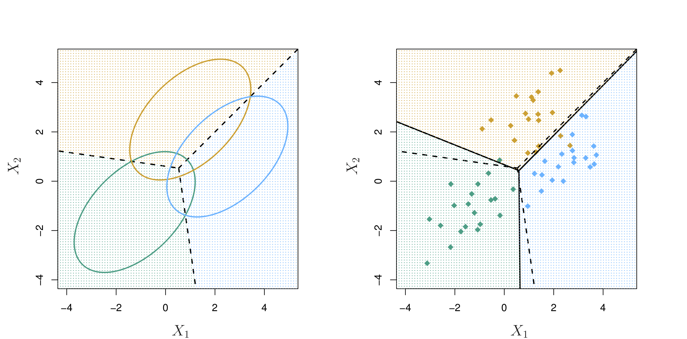

```{r setup, include=FALSE}
knitr::opts_chunk$set(echo = TRUE)
```

**Discriminant Analysis (LDA and QDA)**  
- classification w/>2 classes  
- classes are well-separated  
- small *n* when distribution of predictors is approximately normal in each of the classes

## Discriminant Analysis 
Instead of estimating  $P(Y|X)$ directly, the approach is to estimate  

1. $\widehat P(X|Y)$, the distribution of $X$ in each of the $k$ categories separately
2. $\widehat P(Y)$, the likelihood of each category  

And use Bayes rule to obtain $P(Y|X)$:
$$ P(Y = k|X) = \dfrac{P(X| Y)P(Y)}{P(X)}$$

## Discriminant Analysis  
We write this in a little different form for discriminant analysis:

$$Pr(Y=k|X=x) = \dfrac{\pi_kf_k(x)}{\sum_{l=1}^{K}\pi_lf_l(x)} \textrm{ , where}$$ 

- $f_k(x) = P(X|Y)$ is the density for $X$ in class $k$, assuming a normal (Gaussian) distribution for each class and  

- $\pi_k = P(Y)$ is the prior probability for class $k$.

## Linear Discriminant Analysis  
$f_k(x)$ is large if there is a high probability that an observation in class $k$ has $X \approx x$ and small if it is unlikely $X \approx x$.

<center> 
{ width=50% } 
</center> 
Fig. 4.4: One-dimensional normal density functions, $f_k(x)$, for two different classes (green and pink). Dashed line: optimal decision boundary from Bayes classifier  

## Linear Discriminant Analysis
In practice, we can estimate $f_{green}$ and $f_{pink}$ based on observed data.  
<center> 
{ width=100% } 
</center> 
Fig. 4.4. Solid line: LDA decision boundary  

## Linear Discriminant Analysis
We also can estimate $\pi_{green}(x)$ and $\pi_{pink}(x)$ based on the proportion of training observations in each class.  
<center> 
{ width=90% } 
</center>

<!-- ## Linear Discriminant Analysis   -->
<!-- The Bayes classifier assigns an observation to the class for which $Pr(Y=k|X=x)$ is highest. By assuming a normal distribution for $f_k(x)$, we can use the formula for the probability density function of a random variable, $x$, for observations in class $k$ with mean $\mu_k$ and variance $\sigma^2_k$.  -->

## Linear Discriminant Analysis  
Substituting the probability density function into the equation for Baye's theorem, taking the log, and rearranging the terms, we can obtain the discriminant function (Equation 4.13): $$\delta_k(x) = x\cdot\dfrac{\mu_k}{\sigma^2} - \dfrac{\mu_k^2}{2\sigma^2} + \textrm{log}(\pi_k)$$ 

We assign an observation to the class, $k$, for which $\delta_k(x)$ is greatest.  

With 2 classes and $\pi_1 = \pi_2$, we obtain the decision boundary in Fig. 4.4!

## LDA with multiple predictors  
<center> 
{ width=50% }

Fig. 4.5: Multivariate density function with two **uncorrelated** predictors.  
</center>  

## LDA with multiple predictors  
<center> 
{ width=50% }

Fig. 4.5: Multivariate density function with two **correlated** predictors ($r$ = 0.7).  

## LDA with multiple predictors  
Assuming 3 classes, consider the decision boundaries in Fig. 4.6:
<center> 
{ width=90% }
</center>
What is a plausible correlation coefficient for $X_1$ and $X_2$ for the green class? The blue class? The orange class?  

## LDA with multiple predictors  
**LDA assumes that the covariance structure among predictors is the same for all classes.**  ISL denotes the $p$ x $p$ covariance matrix of X as $\Sigma$.

Note: 
$$ \textrm{Cov}(X,Y) = \sum_{i=1}^N\dfrac{(x_i-\bar{x})(y_i-\bar{y})}{N}$$ 

$$\textrm{Cor}(X, Y) = \dfrac{\textrm{Cov}(X, Y)}{\sigma_{X}\sigma_{Y}}$$

## LDA with multiple predictors  
$\Sigma = 
\begin{bmatrix}
\text{Var}(x_1) & \text{Cov}(x_1, x_2) \\
\text{Cov}(x_1, x_2) & \text{Var}(x_2) \\
\end{bmatrix} = 
\begin{bmatrix}
1 & 2 \\
2 & 5 \\
\end{bmatrix}$ 

```{r echo=F}
library(MASS); library(ggplot2)
mySig <- matrix(c(1, 2, 2, 5), 2)

bivn <- as.data.frame(mvrnorm(500, mu = c(0,0), Sigma = mySig) )
ggplot(data=bivn, aes(x=bivn[,1], y=bivn[,2])) + geom_point(alpha=0.5) + theme_classic() + xlab("x1") + ylab("x2") + xlim(c(-10,10)) + ylim(c(-10,10))
```

## LDA with multiple predictors  
$\Sigma =
\begin{bmatrix}
1 & -2 \\
-2 & 5 \\
\end{bmatrix}$ 

```{r echo=F}
library(MASS); library(ggplot2)
mySig <- matrix(c(1, -2, -2, 5), 2)

bivn <- as.data.frame(mvrnorm(500, mu = c(0,0), Sigma = mySig) )
ggplot(data=bivn, aes(x=bivn[,1], y=bivn[,2])) + geom_point(alpha=0.5) + theme_classic() + xlab("x1") + ylab("x2") + xlim(c(-10,10)) + ylim(c(-10,10))
```

## LDA with multiple predictors  
$\Sigma =
\begin{bmatrix}
1 & 0 \\
0 & 5 \\
\end{bmatrix}$ 

```{r echo=F}
library(MASS); library(ggplot2)
mySig <- matrix(c(1, 0, 0, 5), 2)

bivn <- as.data.frame(mvrnorm(1000, mu = c(0,0), Sigma = mySig) )
ggplot(data=bivn, aes(x=bivn[,1], y=bivn[,2])) + geom_point(alpha=0.5) + theme_classic() + xlab("x1") + ylab("x2")+ xlim(c(-10,10)) + ylim(c(-10,10))
```

## LDA with multiple predictors  
$\Sigma =
\begin{bmatrix}
5 & 0 \\
0 & 1 \\
\end{bmatrix}$ 

```{r echo=F}
library(MASS); library(ggplot2)
mySig <- matrix(c(5, 0, 0, 1), 2)

bivn <- as.data.frame(mvrnorm(1000, mu = c(0,0), Sigma = mySig) )
ggplot(data=bivn, aes(x=bivn[,1], y=bivn[,2])) + geom_point(alpha=0.5) + theme_classic() + xlab("x1") + ylab("x2") + xlim(c(-10,10)) + ylim(c(-10,10))
```

## LDA with multiple predictors  
What if we have a different covariance structure among predictors for each class?  
<center> 
{ width=90% }
</center>

## Quadratic Discriminant Analysis  
- Unlike LDA, QDA assumes that each class has its own $p$ x $p$ covariance matrix.

- The resulting decision boundaries become quadratic  

- Because we estimate covariances for each class separately, a larger $n$ is needed compared to LDA 
    - $p/(p+1)/2$ parameters for LDA covariance matrix vs. $Kp(p+1)/2$ for QDA.

## Quadratic Discriminant Analysis  
For which figure does $\Sigma_{orange} \ne \Sigma_{blue}$?  
<center> 
{ width=90% }
</center>  
Fig. 4.9. Bayes (dashed purple), LDA (dotted black), and QDA (green solid) decision boundaries.    

<!-- ## Comparing among methods   -->
<!-- Confusion matrix for LDA analysis of Default dataset   -->

<!-- ```{r echo=F} -->
<!-- library(caret); library(MASS); library(ISLR); data(Default) -->
<!-- lda.fit = lda(default ~ balance + student, data=Default) -->
<!-- lda.pred=predict(lda.fit, Default) -->
<!-- confusionMatrix(lda.pred$class, Default$default) -->
<!-- ``` -->

