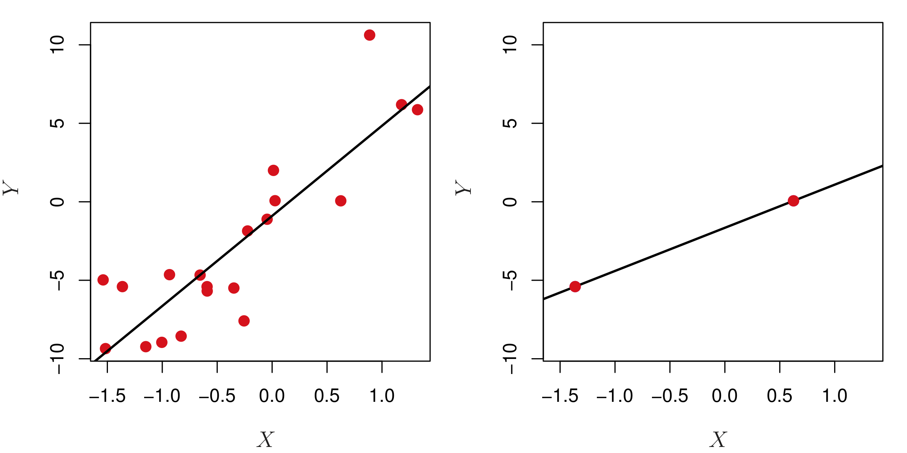
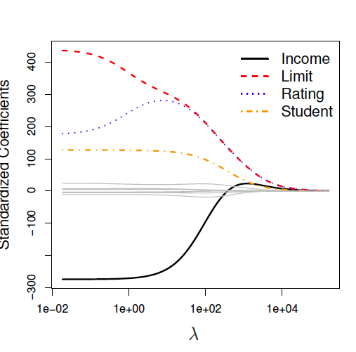
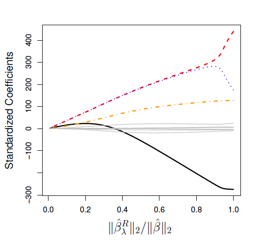
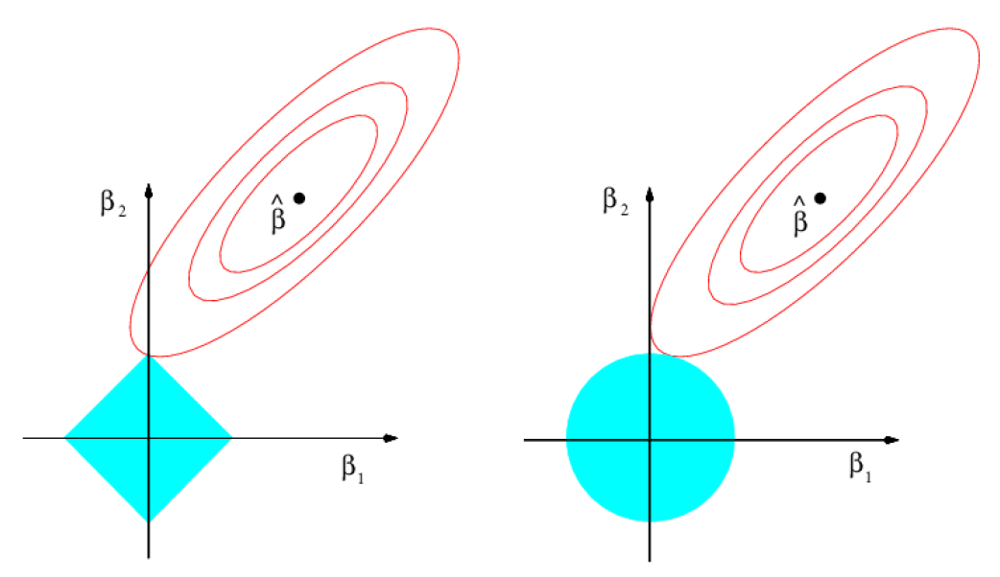
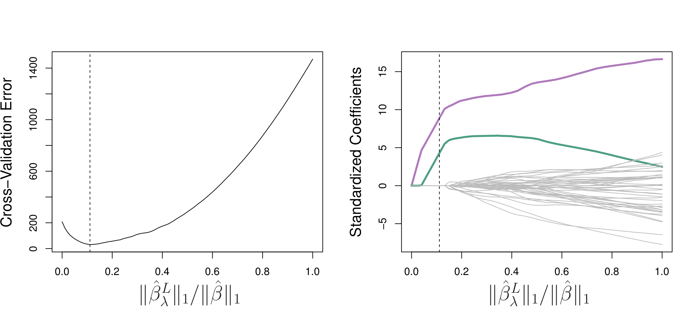
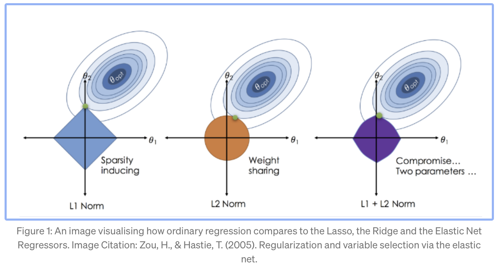

```{r setup, include=FALSE}
knitr::opts_chunk$set(echo = TRUE)
```

## Why do we need alternatives for fitting with least squares? 
+  Prediction accuracy: if $n \approx p$, there can be high variability in least squares fit and overfitting 
   +  If $p$ > $n$, the variance is infinite and least squares fitting cannot be used   
+ Model interpretability: including many irrelevant variables can lead to unnecessary model complexity

## Variability in least squares fit  
With small number of observations per predictor, least squares will yield a set of coefficient estimates that result in a perfect fit to the data and residuals that are zero.

Despite perfect $R^2$ on the training data, this leads to overfitting and poor performance on test datasets. 
<center>
{ width=60%} 
</center>
Fig. 6.22
Estimating 2 parameters ($\beta_0$ and $\beta_1$) based on 20 vs. 2 observations


## Alternatives to fitting with least squares   
1. Subset selection  
    +  Identify a subset of all $p$ predictors we believe are related to the response, and then fit the model using this subset
    + e.g. best subset selection, forward/backward selection  
2. Shrinkage/Regularization
    + Some of the coefficients may shrink to exactly zero (i.e. the lasso)
3. Dimension reduction  
    + Project all $p$ predictors into an $M$-dimensional space where $M < p$, and then perform linear regression model (e.g. principal components regression)  

## Part I: Subset selection  
**Best subset selection**. Select the best model from among all $2^p$ possibilities: 

1. Let $M_0$ denote the null model with no predictors.  
2. For $k = 1, 2, ..., p:$ 
    + fit all $\begin{pmatrix}p\\k\end{pmatrix}$ models that contain exactly $k$ predictors.  
    + pick the best among these models and call it $M_k$.
3. Select a single best model from among $M_0, ..., M_p$  

*Very computationally intensive when $p$ is large! With $2^p$ possibilities, already 1024 models with $p = 10$.*

## Part I: Subset selection  
**Forward stepwise selection.**  Start with a model containing *no* predictors, then add predictors one at a time until all predictors are in the model. At each step, add the variable that gives the greatest additional improvement to the model.  Choose a single best model from among $M_0, ..., M_p$.  

**Backward stepwise selection.**  Start with a model containing *all* predictors, then remove the least useful predictor one at a time.  Choose a single best model from among $M_0, ..., M_p$. 

**Hybrid approaches**  

## Part I: Subset selection  
**Limitations of forward/backward selection:**  

- Backward selection requires $n>p$.  

- 'Best' possible model may not be selected.  

**Advantages:** 

- Less computationally intensive than best subset selection.    

## How to choose the best model?     
The RSS and $R^2$ (for least squares) will always decline/increase as the number of variables increase so they are not very useful to choose the best model. Similarly for  logistic regression, the deviance decreases with increasing number of predictors.  

## How to choose the best model? 
Alternatively, we can: 

1. Indirectly estimate test error by making an adjustment to the training error  
        
    - $C_p$, AIC, BIC, and Adjusted $R^2$ 
        
2. Cross-validation 

## How to choose the best model?     
$C_p$, AIC, BIC, and Adjusted $R^2$ estimate the training error by including a penalty term. E.g.: 

$$C_p = \frac{1}{n}(RSS + 2d\hat{\sigma}^2),$$ where $\hat{\sigma}^2$ is an estimate of the variance of the error associated with each response measurement and $d$ is the number of predictors.  

## Part II: Shrinkage (Ridge Regression)  
Remember least squares, in which we fit the coefficients $\beta_0, \beta_1, .., \beta_p$ in an effort to minimize the residual sum of squares: 

$$RSS = \sum_{i=1}^n(y_i - \beta_0 -\sum_{j=1}^p\beta_jx_{ij})^2$$

## Ridge Regression  
*Ridge regression* is similar to least squares, but coefficients are estimated by minimizing a different quantity:  
$$RSS + \lambda\sum_{j=1}^p\beta_j^2$$  
where $\lambda \geq 0$ is a tuning parameter.  

## Ridge Regression  
*Ridge regression* is similar to least squares, but coefficients are estimated by minimizing a different quantity:  
$$RSS + \lambda\sum_{j=1}^p\beta_j^2$$  
where $\lambda \geq 0$ is a tuning parameter.  

The second term is a shrinkage penalty.  Imposing this constraint should improve the fit, because shrinking the coefficients can significantly reduce their variance.  

Note that the penalty term does not include the intercept $\beta_0$, which is just a measure of the mean response when $x_{i1} = x_{i2} = ... = x_{ip} = 0$  

## Ridge Regression 
$$RSS + \lambda\sum_{j=1}^p\beta_j^2$$  

What happens when $\lambda =0$?  


## Ridge Regression 
$$RSS + \lambda\sum_{j=1}^p\beta_j^2$$  

What happens when $\lambda \rightarrow \infty$ ?  

## Ridge Regression  
<center>
{ width=70% }
</center>  
Fig. 6.4a 

## Ridge Regression  
Ridge regression uses L2 regularization to prevent overfitting.  

$||\beta||_2$ denotes the $\ell_2$ norm of a vector, in this case the vector of coefficient estimates, $\hat\beta$.

It measures the distance of $\beta$ from zero.

It is given by the equation $||\beta||_2 = \sqrt{\sum_{j=1}^p\beta_j^2}$.

<!-- ## Ridge Regression   -->
<!-- <center> -->
<!-- { width=70% } -->
<!-- </center>   -->
<!-- Fig. 6.4b  -->

## Ridge Regression  
<center>
{ width=60% }
</center>  

In Fig. 6.4, what side of the x-axis corresponds to $\lambda$ being very large? Very small?

## Ridge Regression 
$$RSS + \lambda\sum_{j=1}^p\beta_j^2$$  

Why do you think it is recommended to standardize the predictors (so that all have standard deviation of one) before carrying out ridge regression?  

## Ridge Regression 
$$RSS + \lambda\sum_{j=1}^p\beta_j^2$$  

Least squares coefficient estimates are *scale equivariant*: multiplying $X_j$ by a constant *c* simply leads to scaling of coefficient estimates by a factor of 1/*c*. 

In contrast, the ridge regression coefficient estimate for $X_j$ will depend on the scaling of the *j*th predictor as well as other predictors due to the regularization term.  


## Ridge Regression 
- Works well in situations where least squares estimates have high variance ($p \approx n$). 

- Only fits a single model for any fixed value of $\lambda$, so is more computationally efficient than best subset selection.  

- Assumes all predictors are related to response (can't set any coefficients to exactly 0).   

## Part II: Shrinkage methods (The Lasso)
*The lasso* can set some coefficients to zero by using a different penalty (an $\ell_1$ penalty instead of an $\ell_2$ penalty):
$$RSS + \lambda\sum_{j=1}^p|\beta_j|$$

## The Lasso
<center>
{ width=70% }
</center>

## Why does lasso set some predictors to exactly 0?
Consider $p$ = 2 predictors:
<center>
{ width=70% }
</center>
Fig. 6.7

Solid blue areas represent constraint regions $|\beta_1| + |\beta_2| \le s$ and $\beta_1^2 + \beta_2^2 \le s$ while red ellipses are contours of the RSS. 

## Lasso vs. least squares
<center>
{ width=100% }
</center>
Fig. 6.13
Simulated data with only two predictors truly related to the response. Minimum cross-validation error corresponds to a $\lambda$ for which only these two predictors have large coefficient estimates. 

## Ridge regression vs. Lasso
When might ridge regression be better than the lasso?

When might the lasso be better than ridge regression?

How would each treat the issue of multicollinearity?  

## Elastic net regularization 
Elastic net combines L1 and L2 penalties. 

$$RSS + \lambda_1\sum_{j=1}^p|\beta_j| + \lambda_2\sum_{j=1}^p\beta_j^2$$  

Let $\alpha = \frac{\lambda_2}{\lambda_1 + \lambda_2}$, then  $\sum_{j=1}^{p}(\alpha|\beta_j| + (1 - \alpha)\beta_j^2)$ is the elastic net penalty 

## Elastic net regularization 
<center>
{ width=100% }
</center>
