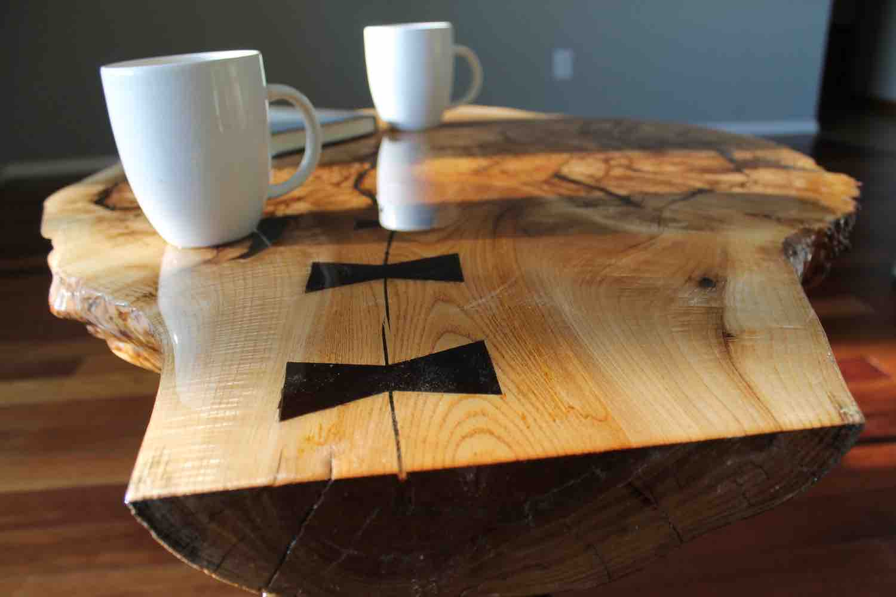
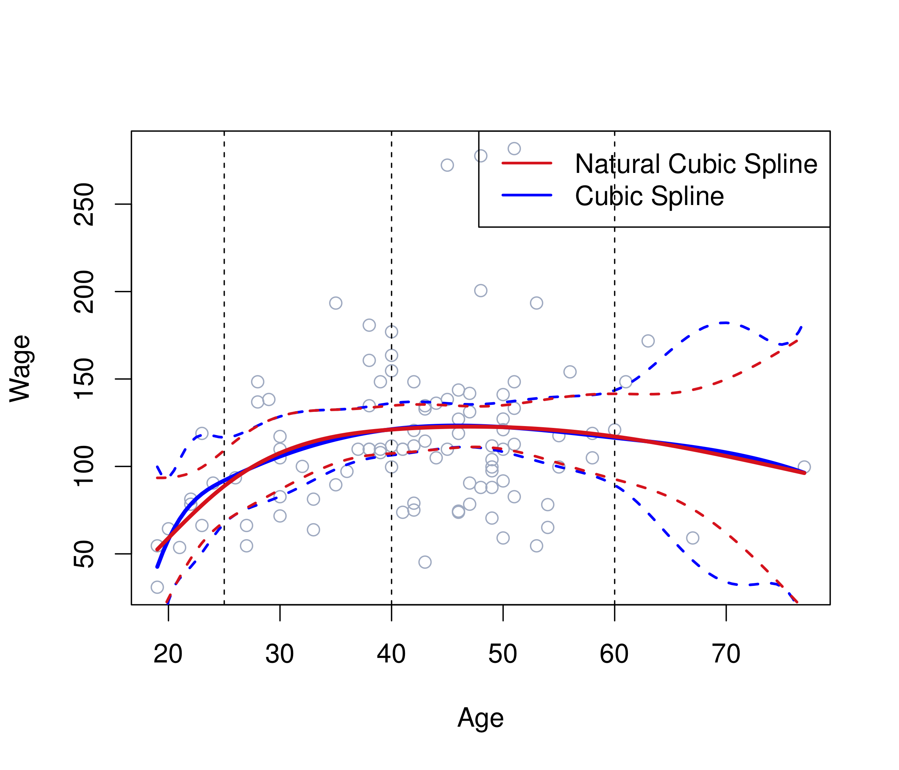

```{r setup, include=FALSE}
knitr::opts_chunk$set(echo = FALSE)
```

## Outline (non-linearity in a single predictor)  
- Polynomial regression  
- Step functions  
- Regression splines  
- Smoothing splines 

## Basis functions 
A family of functions or transformations that can be applied to a variable $X:b_1(X), b_2(X),..., b_K(X)$. 

Once the basis functions have been determined, the models are linear in these new variables and the fitting proceeds as before:
$$y_i = \beta_0 + \beta_1b_1(x_i) + \beta_2b_2(x_i)+...+\beta_Kb_K(x_i) + \epsilon_i$$

## Polynomial Regression  
One way to provide a non-linear fit to data is just to include extra predictors, obtained by raising each of the original predictors to a power. The coefficients can be estimated using least squares.    

$$y_i = \beta_0 + \beta_1x_i + \beta_2x{_i}{^2} + \beta_3x{_i}{^3} + ... + \beta_dx{_i}{^d} + \epsilon_i $$  
Here, the basis function is $b_j(x_i) = x_i^j$

Typically, $d \le 4$, since the polynomial curve can take some very strange shapes if $d$ is large.

## Polynomial Regression  
Degree-4 polynomial of wage as a function of age, with wage as a quantitative (left) or binary (right) response:  
<center>
{ width=80%} 

</center>

## Step Functions  
Polynomial regression imposes *global* structure on the non-linear function of $X$.  

Alternatively, we can break the range of $X$ into bins and fit a different constant in each bin.  

$$C_0(X) = I(X < c_1),$$
$$C_1(X) = I(c_1 \le X < c_2)$$
$$C_2(X) = I(c_2 \le X < c_3)$$
$$\vdots$$
$$C_K(X) = I(c_K \le X)$$
$I(\cdot)$ is an indicator function that returns 1 if the condition is true and 0 otherwise.  For example, $I(c_K \le X)$ returns 1 if $c_K \le X$.

## Step Functions 
We can then use least squares to fit a linear model using $C_1(X), C_2(X), ..., C_K(X)$ as predictors:

$$y_i = \beta_0 + \beta_1C_1(x_i) + \beta_2C_2(x_i)+ ...+\beta_KC_K(x_i) + \epsilon_i$$

## Step Functions  
Piecewise-constant functions can miss the action: 

<center>
{ width=80%} 

</center>

## Regression Splines  
Combining these approaches, we have *piecewise polynomial regression*, in which we fit separate low-degree polynomials over different regions of $X$.

$$y_i = \begin{cases} \beta_{01} + \beta_{11}x_i + \beta_{21}x_i^2 +  \beta_{31}x_i^3 + \epsilon_i  \quad\text{ if } x_i < c; \\ 
\beta_{02} + \beta_{12}x_i + \beta_{22}x_i^2 +  \beta_{32}x_i^3 + \epsilon_i  \quad\text{ if } x_i \ge c. \end{cases}
$$

The point where the coefficient changes is a *knot*. We can use more knots and different degree polynomials.  

## Regression Splines 

<center>
{width=60%}  

</center>  

## Regression Splines 
Joining fitted curves by using constraints  
<center>
{width=60%} 

</center>

## Regression Splines  
We can join the curves by imposing the constraint that the fitted curve must be continuous (top right, bottom right). 

Additional smoothness can be introduced by adding additional constraints: the first and second derivatives of the piecewise polynomials are also continuous at the knots (bottom left).  

<center>
{width=50%} 
</center>

<!-- ## Regression Splines   -->
<!-- To fit a cubic spline to a dataset with *K* knots, we perform least squares regression with an intercept and 3 + *K* predictors: $X, X^2, X^3, h(X, \xi_1), h(X, \xi_2), ..., h(X, \xi_K)$. -->

<!-- Here, $\xi_1, ..., \xi_K$ are the knots and $h(x, \xi)$ is a truncated power function: -->

<!-- $$h(x, \xi) = (x-\xi)_+^3 = \begin{cases} (x - \xi)^3 \quad \text{if } x > \xi&\\ 0 \quad\text{otherwise}\end{cases} $$ -->

<!-- ## Regression Splines   -->
<!-- Adding a term of the form $\beta * h(x,\xi)$ leads to a discontinuity in only the third derivative at $\xi$, which is not visible to the human eye.   -->

<!-- How many $\beta*h(x,\xi)$ terms to add if we have 4 knots? -->

## Regression Splines 
To reduce variance in the regions before the first knot and after the last knot, we can add an additional constraint that the function is required to be linear at the boundaries. This is known as a *natural spline*.  

<center>
{width=60%} 

</center>

## Smoothing Splines  
An alternative way to fit a smooth curve to a set of data is to fit a function that minimizes the "Loss + Penalty" formulation we discussed in Chp. 6:  

$$ \sum_{i=1}^n(y_i - g(x_i))^2 + \lambda\int g''(t)^2dt$$  

## Smoothing Splines  
An alternative way to fit a smooth curve to a set of data is to fit a function that minimizes the "Loss + Penalty" formulation we discussed in Chp. 6:  

$$ \sum_{i=1}^n(y_i - g(x_i))^2 + \lambda\int g''(t)^2dt$$  

Here, $\lambda$ is a nonnegative tuning parameter, $g$ is a smoothing spline, and $g''(t)$ measures the amount by which the slope of $g$ is changing at $t$.

*The $g(x)$ that minimizes the formulation above is a shrunken version of a natural cubic spline with knots at every $x$*.

<!-- ## Smoothing Splines   -->
<!-- Considering that the second derivative of a straight line is zero, is $\int g''(t)^2df$ relatively large or small if $g$ is very jumpy? -->

## Smoothing Splines 

$$ \sum_{i=1}^n(y_i - g(x_i))^2 + \lambda\int g''(t)^2dt$$

What does $g$ look like when $\lambda = 0$? When $\lambda \to \infty$?

<!-- ## Local Regression   -->
<!-- Compute the fit at a target point $x_0$ using only the nearby training observations.   -->

<!-- 1. Gather the fraction $s=k/n$ of training points whose $x_i$ are closest to $x_0$, where $s$ is the span.   -->
<!-- 2. Assign a weight, $K_{i0}$, to each point in this neighborhood so that the point furthest from $x_0$ has weight zero and closest has highest weight.  Outside of this neighborhood, points receive a weight of zero. -->
<!-- 3. Fit a *weighted least squares regression* of the $y_i$ on $x_i$. -->

<!-- ## Local Regression  -->
<!-- <center> -->
<!-- {width=80%}  -->
<!-- </center> -->
<!-- What is the impact of decreasing $s$?   -->

<!-- ## Local Regression  -->
<!-- <center> -->
<!-- {width=80%}  -->
<!-- </center>   -->

<!-- In practice, not a great method for large $p$ and requires all the training data every time we wish to compute a prediction.  -->

## Summary   
To provide a non-linear fit to data, we can use **polynomial regression** (global) or break up the range of a variable into different regions, which can be fit locally with constant (**step function**), linear, or other power functions.  We can introduce additional constraints to connect and smooth these functions (**regression splines**).

Alternatively, we can optimize the "Loss + Penalty" objective of machine learning (**smoothing splines**) or perform weighted regression within the neighborhood of a point of interest (**local regression**).  

## Next class:
- Today we have investigated non-linear relationships of a response with a single predictor.

- GAMs are a multivariate extension of these approaches.
    - Please read Chp. 7.6 on GAMs
    - Deleo *et al.* (2019) on GAMs for spatio-temporal analysis of trait variation data