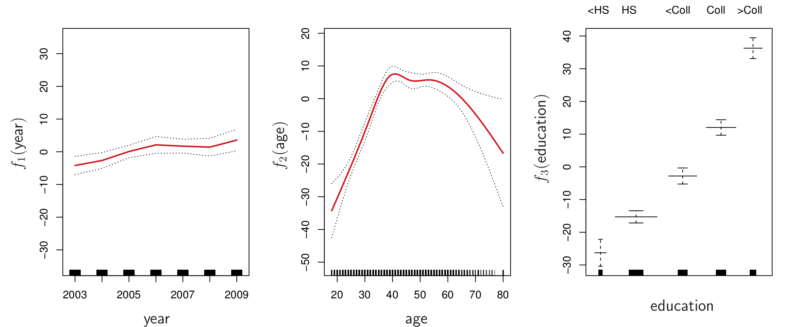
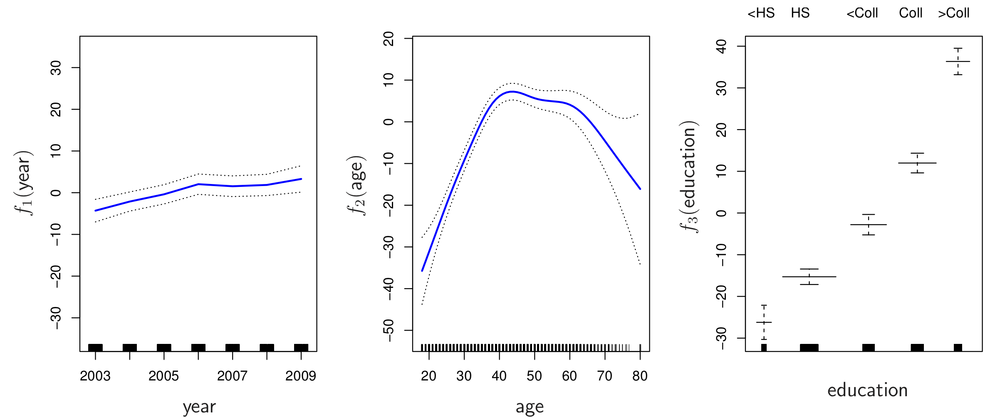

```{r setup, include=FALSE}
knitr::opts_chunk$set(echo = FALSE)
options(tinytex.verbose = TRUE)
```

## Last Time  
- Polynomial Regression
- Step functions
- Regression splines
- Smoothing splines  

## Generalized Additive Models
Goal: flexibly predict *Y* on the basis of **several** predictors.

GAMS allow non-linear functions of each predictor while maintaining *additivity* (calculate a separate $f_j$ for each $X_j$ and then add together all of their contributions).

## GAMs for Regression
$$y_i = \beta_0 + \sum_{j=1}^{p}f_j(x_{ij}) + \epsilon_i$$ 

$$= \beta_0 + f_1(x_{i1}) + f_2(x_{i2}) + ... + f_p(x_{ip}) + \epsilon_i$$

## GAMs for Regression
We can 'mix & match' methods we discussed before (e.g. splines, local regression, polynomial regression) to provide different non-linear fits for each variable.

Consider the following for the Wage dataset, where 'year' and 'age' are quantitative variables and 'education' is qualitative with 5 levels (<HS, HS, <Coll, Coll, >Coll):

$$\text{wage} = \beta_0 + f_1(\text{year})+ f_2(\text{age}) +  f_3(\text{education}) + \epsilon_i$$

## GAMs for Regression
Remember, with one predictor:
<center>
{width=70%}

</center>

## GAMs for Regression
GAM with natural splines for $f_1$ and $f_2$ and a step function for $f_3$ (ISL Fig. 7.11):

<center>
{width=90%}
</center>
Because natural splines are constructed using basis functions, this model is just a big regression onto the spline basis variables and dummy variables.  We can fit it with least squares.

## GAMs for Regression
GAM with smoothing splines for $f_1$ and $f_2$ and a step function for $f_3$ (ISL Fig. 7.12):

<center>
{width=90%}
</center>
Least squares cannot be used for smoothing splines.  Instead, we can use backfitting.

## GAMs for Classification

$$\text{log}\left( \frac{p(X)}{1-p(X)} \right) = \beta_0 + f_1(X_1)+ f_2(X_2) + ... + f_p(X_p)$$

## GAMs for Classification
Consider the Wage example:

$$\text{log}\left( \frac{p(X)}{1-p(X)} \right) = \beta_0 + \beta_1\times\text{year}+ f_2(\text{age}) + f_3(\text{education})$$ where $p(X) = \text{Pr}(\text{wage} > 250 |\text{year,age,education}).$

<center>
{width=90%}
</center>
ISL Fig. 7.14

## Considerations
+ Fit a different non-linear $f_j$ to each $X_j$ automatically
+ Potential for more accurate predictions with more flexibility
+ Can examine the effect of each $X_j$ on $Y$ individually, holding other variables fixed.
- Model is restricted to be additive (need to manually add interaction terms)
